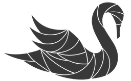

<!--
 Copyright (c) 2017 Intel Corporation

 Licensed under the Apache License, Version 2.0 (the "License");
 you may not use this file except in compliance with the License.
 You may obtain a copy of the License at

      http://www.apache.org/licenses/LICENSE-2.0

 Unless required by applicable law or agreed to in writing, software
 distributed under the License is distributed on an "AS IS" BASIS,
 WITHOUT WARRANTIES OR CONDITIONS OF ANY KIND, either express or implied.
 See the License for the specific language governing permissions and
 limitations under the License.
-->

# Swan

_Scheduler Workloads ANalysis_

## Overview
Swan is a distributed experimentation framework for automated experiments and data collection targeting performance isolation studies. Read Swan [product vision](docs/vision.md) to see what Swan aims for.

Swan use [Snap](https://github.com/intelsdi-x/snap) to collect, process and tag metrics and stores all experiment data in [Cassandra](http://cassandra.apache.org/).
From here, we provide a [Jupyter](http://jupyter.org/) environment to explore and visualize experiment data (more documentation [here](jupyter/README.md)).

Read the [architecture document](docs/architecture.md) to learn more.

The first experiment which bundles with Swan is a sensitivity experiment for the distributed
data cache, [memcached](https://memcached.org/). The experiment enables experimenters to generate
a so-called _sensitivity profile_, which describes the violation of _Quality of Service_ under certain conditions, such as CPU cache or network bandwidth interference. An example of the _sensitivity profile_ can be seen below.

During the experiment *memcached* is co-located with several types of _aggressors_, which are low priority jobs. Memcached response time is critical and needs to stay below a given value which is called _Service Level Objective_ (SLO). SLO is memcached _Quality of Service_ that needs to be maintained. The goal of the experiment is to learn which aggressors interferes the least and which the most with memcached so that some of them can be safely co-located with it without violating memcached _Quality of Service_. _Sensitivity profile_ answers that. Co-location of tasks increases machine utilization which in datacenter [can be low as 12%](https://www.nrdc.org/sites/default/files/data-center-efficiency-assessment-IP.pdf) decreasing _TCO_ of the datacenter. 

Memcached sensitivity experiment is described in detail in [memcached sensitivity profile document](experiments/memcached-sensitivity-profile/README.md).

To read more about general idea behind experiment please refer to the [architecture](docs/architecture.md) document.

## System requirements

Please see [installation guide](docs/install.md#prerequisites) for details.

## Installation

For installation instruction please refer to the [installation guide](docs/install.md).

## Getting started

[Installation guide](docs/install.md) provides step necessary to setup environment and [Sensitivity experiment](experiments/memcached-sensitivity-profile/README.md) document gives instructions how to setup first experiment in the virtual machine.

## Contributing

Best practices for Swan development and submitting code is documented [here](docs/development.md).
