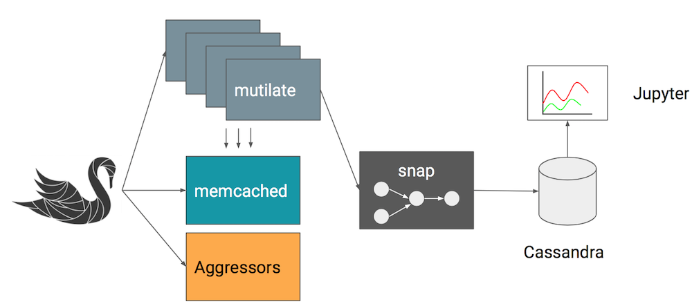

# Swan


_Scheduler Workloads ANalysis_

[](https://travis-ci.com/intelsdi-x/swan)

Swan is a distributed experimentation framework for automated experiments and data collection targeting performance isolation studies.

Swan use [Snap](https://github.com/intelsdi-x/snap) to collect, process and tag metrics and stores all experiment data in [Cassandra](http://cassandra.apache.org/).
From here, we provide a [Jupyter](http://jupyter.org/) environment to explore and visualize experiment data.

The first experiment which bundles with Swan is a sensitivity experiment for the distributed
data cache, [memcached](https://memcached.org/). The experiment enables experimenters to generate
a so-called sensitivity profile, which describes the violation of Quality of Service under certain
conditions, such as cpu cache or network bandwidth interference. An example of this can be seen below.


Swan does this by carefully controlling execution of memcached and its co-location with aggressor
processes i.e. noisy neighbors or antagonists. From this point on, Swan coordinates execution of
a distributed load generator called [mutilate](https://github.com/leverich/mutilate).
Snap plugins and tasks are coordinated by swan to collect latency and load metrics and tags them
with experiment identifiers. When the experiment is done, experimenters can fetch the data from
Cassandra or explore the data through Jupyter.



Read more [here](experiments/memcached-sensitivity-profile/README.md) for information about how to configure and run this experiment.

## Getting started

To build the memcached experiment, run the following:

```bash
$ go get github.com/intelsdi-x/swan
$ make deps
$ make build
$ ./build/experiments/memcached/memcached-sensitivity-profile
```

**NOTE** Tested on Linux Centos 7

## Contributing

Best practices for Swan development and submitting code is documented [here](docs/development.md).
