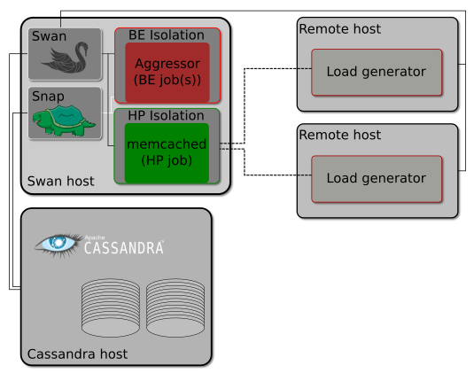

#  Swan 

# Architecture overview
Swan is a distributed framework for automated experiments and data collection targeting performance isolation studies.

Swan uses [Snap](https://github.com/intelsdi-x/snap) to collect, process and tag metrics and stores all experiment's data in [Cassandra](http://cassandra.apache.org/) database.
From here, we provide a [Jupyter](http://jupyter.org/) environment to explore and visualize experiment results.

The first experiment bundled with Swan is a [sensitivity experiment](../experiments/memcached-sensitivity-profile/README.md) for the distributed
data cache, [memcached](https://memcached.org/). The experiment allows to generate
a so-called _sensitivity profile_, which describes the violation of _Quality of Service_ under certain conditions, such as CPU cache or network bandwidth interference. An example of the _sensitivity profile_ can be seen below.

Following figure illustrates _Memcached sensitivity experiment_ architecture.

The main components here are:

* The _Swan host_ where experiment is carried out and metrics are collected
  * Protected workload is located on this host with dedicated isolation
  * Aggressor(s) are located on this host with dedicated isolation
* The _Cassandra cluster_ where Cassandra database responsible for storing experiments meta data from Swan and experiment results from Snap is located.
* The _Remote hosts_ which act as load generators for _memcached_. Mutilate agents are being run on remote hosts to put _memcached_ on configured load. Note that _mutilate_ agents tasks are under complete control over _Swan_. 

# Architecture details

Swan does not force any type of experiment. Instead, it provides abstractions and building blocks necessary for building experiments. Those abstractions helps with:
* Managing life cycle of the workloads (launching, stopping, monitoring and intercepting output).
* Isolating tasks (to test co-located workloads)

The life cycle abstraction is composed of the following interfaces:

* [Launcher](../pkg/executor/launcher.go) which in general translates the workload configuration into string which can be directly launched as in command line. It offers method `Launch()`.

* [Executor](../pkg/executor/executor.go) which takes care of how to launch the workload. It offers method `Execute()` which takes command as a string parameter. 

* [TaskHandle](../pkg/executor/task_handle.go) which controls launched workload, has information about the task's status and is responsible of delivering workload's `stderr` and `stdout`. _Launcher_ on `Launch()` and _Executor_ on `Execute()` returns _TaskHandle_.

Isolation consists of a single interface:

* [Isolation](../pkg/isolation/isolation.go) which can be used to limit workload access to shared resources like CPU.

_Swan_ provides already implemented executors:
* [Local](../pkg/executor/local.go) - for launching workloads on _Swan_ host
* [Remote](../pkg/executor/remote.go) - for launching workloads on remote hosts (using ssh)
* [Kubernetes](../pkg/executor/kubernetes.go) - for launching workloads on kubernetes

and launchers for some aggressors that can be viewed at [swan/pkg/workloads](../pkg/workloads).

As an illustration for the abstractions above [l1data](../pkg/workloads/low_level/l1data/l1data.go) aggressor `Launcher` implementation will be explained in detail. The `l1data.New()` method takes `Executor` and configuration as input parameters and then the workload can be started by calling `l1data.Launch()`. Internally in the `Launch()` method the command line string is build from provided configuration and then it's passed to the provided `Executor` which will take care of executing it (locally, remotely or on Kubernetes). Note that what to launch and how to launch it is clearly separated into two abstractions: Launcher and Executor. It allows using single `Launcher` with several `Executors`. 

## Results

_Snap_ gathers experiment results using collector plugins for mutilate and caffe (in inference mode) and publish then using [Cassandra publisher](https://github.com/intelsdi-x/snap-plugin-collector-cassandra) (see [here](../misc) for more details).

## Experiment

The provided _sensitivity experiment_ itself is composed from:
* Validating and preparing environment
* Launching workloads with proper order
* measurement in the given time window
* stopping workloads
* gathering results and sending them to the Cassandra DB
* repeating all the above changing aggressors, isolation, load and so on.

Examples of experiments can be found in [experiments](../experiments) directory in _Swan_'s repository.

