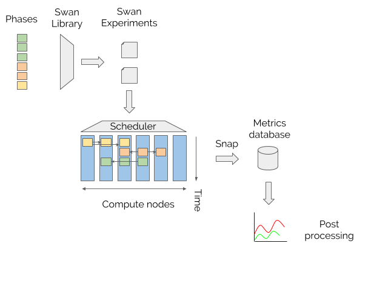

#  Swan

# Vision and motivation

Swan is an experiment and evaluation methodology for optimizing cloud schedulers.
Through coordination of distributed testing, Swan provides a framework to capture real cloud workloads and ability for developers and operators to gain deep insight into their workload behavior in a controlled environment.
Swan emphasizes the need for _co-located_ workloads experiments.
Modern infrastructures run tens to hundreds of tasks per server and the different combinations of how those get placed on a server turns out to be a huge problem space to uncover.
We treat this exploration as a workload in itself.

## History

Swan was developed as a way to build cluster scheduler optimizations _without_ having access to our own production workloads.
The team was working on an optimization and found themselves tweaking parameters by hand and manually observe the change in performance on dashboards. However, it is extremely hard to reason about whether choosing a certain set of parameters will benefit or even negatively influence other workloads.
On top of this, the parameter space for the _co-located_ workloads can be immense and not viable for manual testing. While we could test workloads in a one to one fashion, we had little to no insight into whether our optimizations would keep being useful with others.
So we thought we needed a way to _systematically_ test these optimizations.
We started work on Swan in early 2016 and has been the primary validation framework for oversubscription policies developed by the team.

## Principles

### Swan as a library

Experiment setups can be complex and involve standing up and configuring services, software and hardware, and span many machines.
For that reason, and because of the parallel opportunity, experiments are _written in code_ and swan provides library for running distributed experiments under tightly controlled conditions.
The experiment abstractions does not try to shoehorn a particular format for the output or analysis, but provides just enough help experiment developers make this happen.

### Decouple experiment and analysis

Swan is intended to be the experiment driver, but leave experiment data processing to other tools.
Swan does provide an interactive Python environment in Jupyter to pull the data into Python Pandas data frames but the data is available for processing by any tool.
Alongside raw metrics, Swan stores meta data associated with the experiment identifier which encodes details around the experiment setup.
This can be details like the hardware architecture and software configuration, the choice of core ids for protected jobs and aggressors and much more.
As an example, meta data can help to correlate results with specific performance isolation configuration during result analysis. This can help operators and system developers with insights into what shared resources workloads are sensitive to and encode this information in configurations and policies.

## What is Swan _not_

### Swan is not intended to be an absolute benchmark.

Swan is intended to be an experiment driver but experiment data is purely intended to be relative comparisons opposed to absolute ones.

### Swan is not intended to be coupled to any particular experiment.

While the first experiment shipping with Swan is a sensitivity analysis for services like memcached, we aim for a more expressive experiment development environment.
