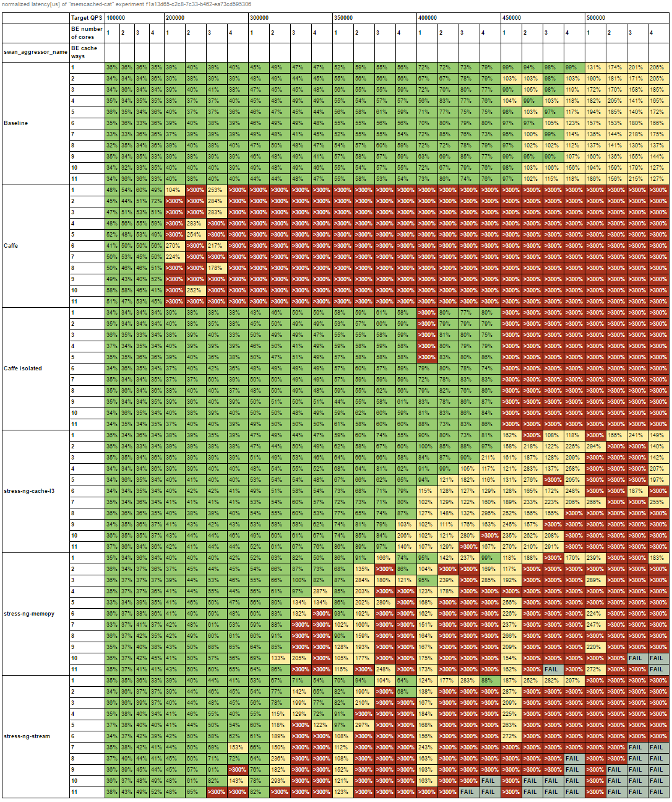
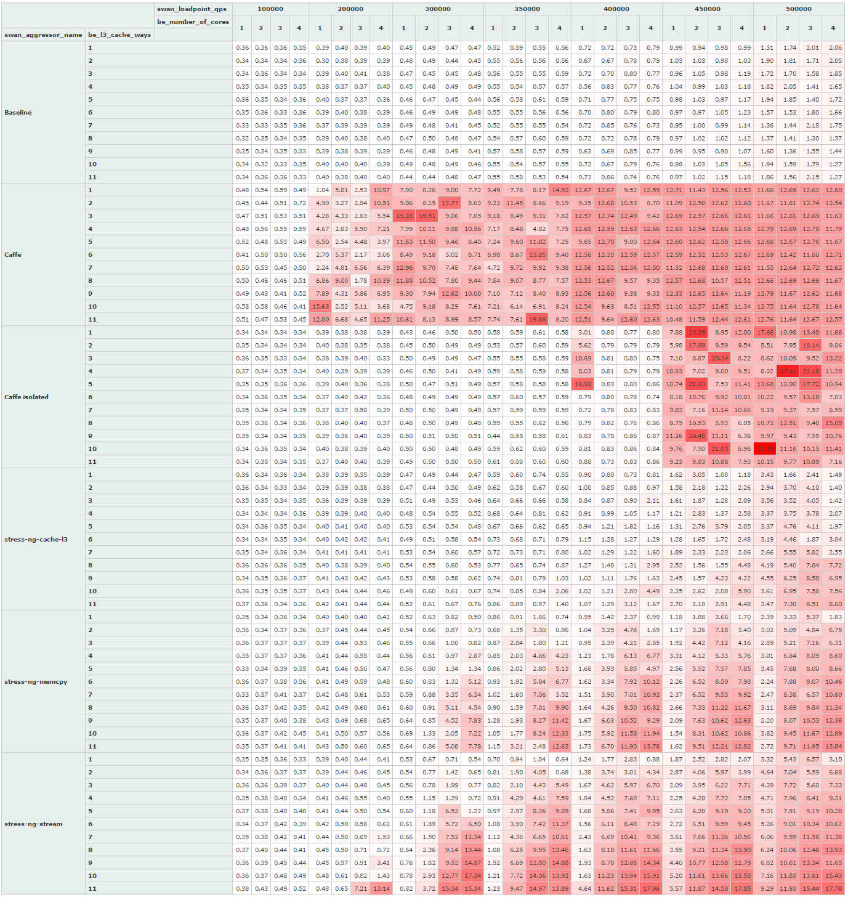
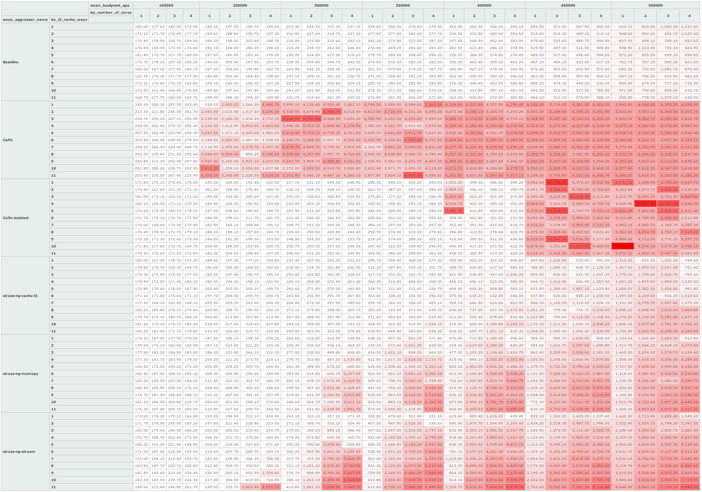
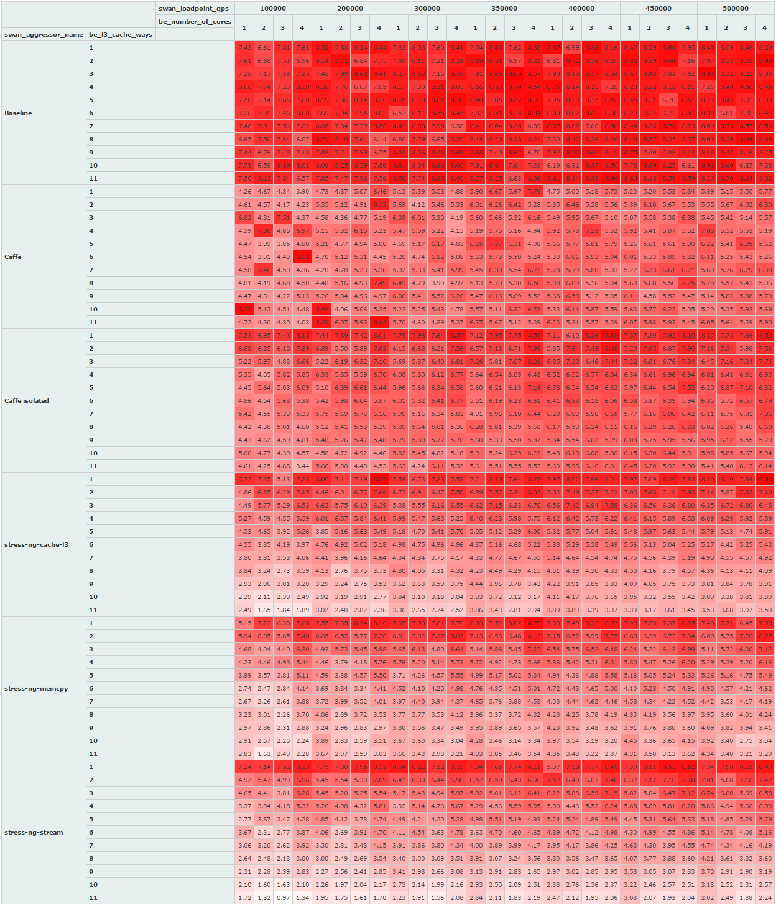
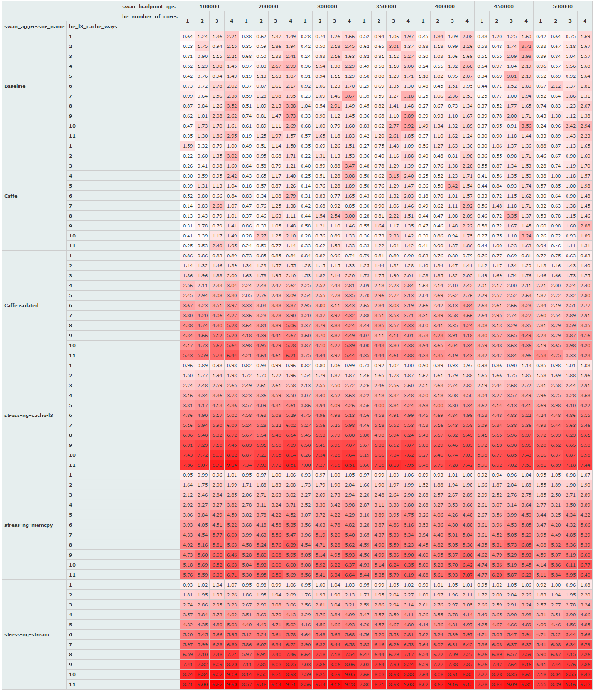
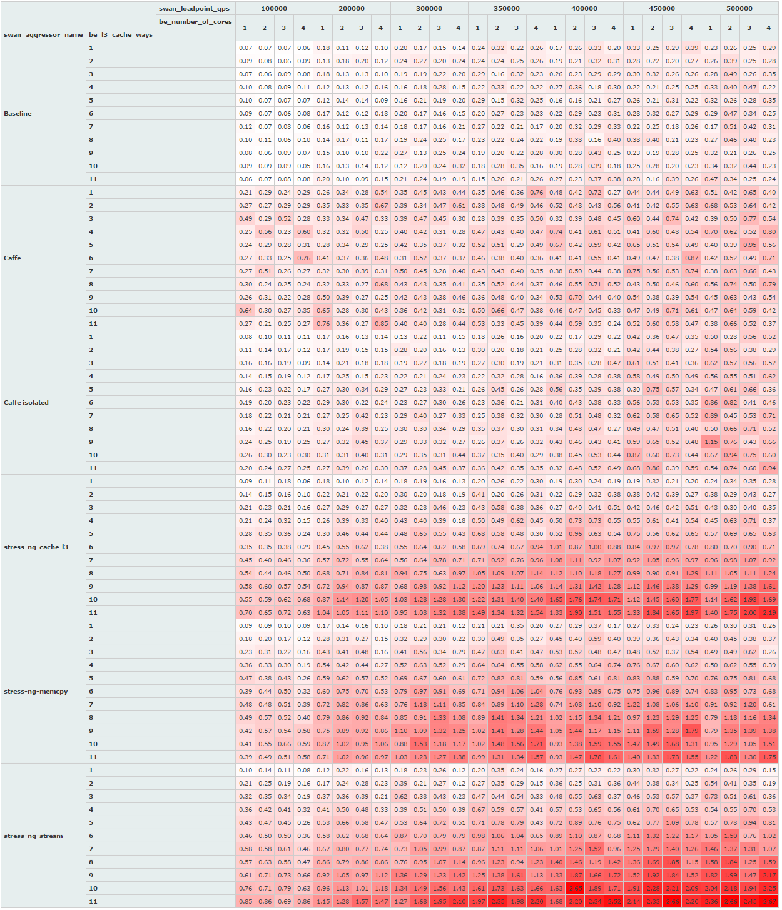
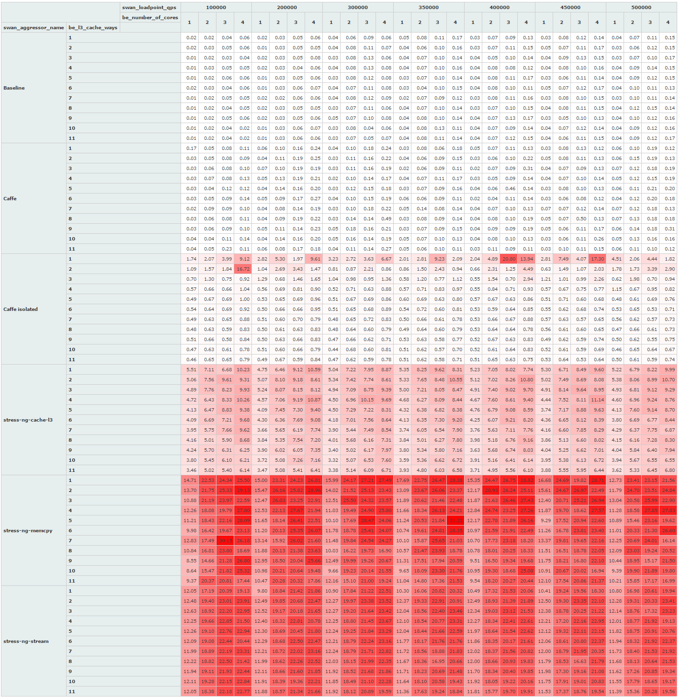

<!--
 Copyright (c) 2017 Intel Corporation

 Licensed under the Apache License, Version 2.0 (the "License");
 you may not use this file except in compliance with the License.
 You may obtain a copy of the License at

      http://www.apache.org/licenses/LICENSE-2.0

 Unless required by applicable law or agreed to in writing, software
 distributed under the License is distributed on an "AS IS" BASIS,
 WITHOUT WARRANTIES OR CONDITIONS OF ANY KIND, either express or implied.
 See the License for the specific language governing permissions and
 limitations under the License.
-->

## Example results of Memcached CAT experiment.

### Application performance metrics.

#### SLI violation table.

#### Raw latency normalized to SLO.

#### Raw latency absolute.

### Platform Intel RDT (CMT/MBM) metrics.

#### memcached (HighPriority) LastLevelCache Occupancy (MB)

#### Aggressors LastLevelCache Occupancy (MB)

#### memcached (High Priority) memory bandwidth (GB)

#### Aggressors memory bandwidth (GB)

