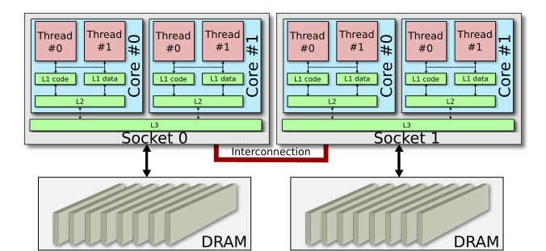
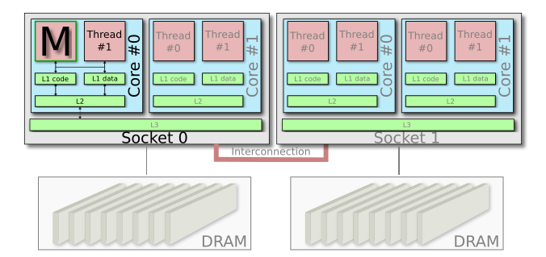
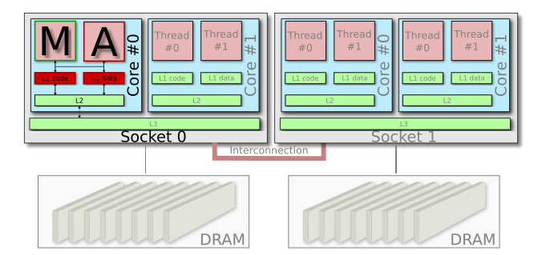
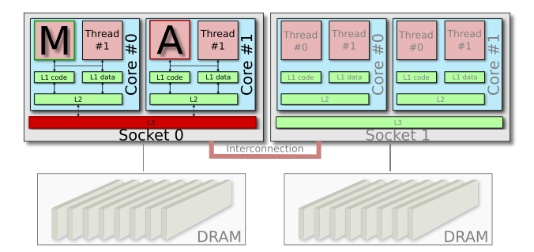

# Memcached sensitivity experiment

The first experiment which comes with Swan is a sensitivity experiment for the distributed data cache, [memcached](https://memcached.org/). The experiment enables experimenters to generate a so-called sensitivity profile, which describes the violation of Quality of Service under certain conditions, such as cpu cache or network bandwidth interference. An example of this can be seen below.


Swan does this by carefully controlling execution of memcached and its co-location with aggressor processes i.e. noisy neighbors or antagonists. From this point on, Swan coordinates execution of a distributed load generator called [mutilate](https://github.com/leverich/mutilate). Snap plugins and tasks are coordinated by swan to collect latency and load metrics and tags them with experiment identifiers.

The memcached sensitivity experiment carries out several measurements to inspect the performance of co-located workloads on a single node. The experiment exercises memcached under several conditions and gathers Quality of Service metrics like latency, so-called Service Level Indicators or SLI for short, and the achieved load in terms of Request per Second, RPS or Queries Per Second (QPS).

The conditions, currently, involve co-location of memcached with a list of specialized aggressors and one deep-learning workload:

## Prerequisites

While the experiment can be run in a developer setting from within a virtual machine or on your own laptop, the experiment is targeted a data center environment with high bandwidth links and rich multi socket servers. It can be a surprisingly tricky exercise to rule out unintended sources of interference in these experiments, so below is a guide to setting up the experiment and some guidance in how to debug a misbehaving setup.

### Snap

Swan use Snap to collect and process i.e. tag metrics, and store them in Cassandra. Swan does not stand up a Snap cluster, as users may already have this installed and set up in [tribes](https://github.com/intelsdi-x/snap/blob/master/docs/TRIBE.md) on machines in the cluster.

See the [Snap installation guide](https://github.com/intelsdi-x/snap) for guidance of how to configure and install `snapd`. `snapd` should be running on the host running the swan binary.

### Cassandra

Another dependency is a running Cassandra cluster. Again, it is out of the scope for Swan to stand up Cassandra and use of a shared Cassandra cluster is recommended. See [Datastax's installation guide](http://docs.datastax.com/en/cassandra/3.x/cassandra/cassandraAbout.html) for information about how to install and operate Cassandra clusters. For development purposes, you can start Cassandra from a docker container with:

```
docker run -d -p :9042:9042 -p :9160:9160 cassandra
```

**NOTE** Running Cassandra in docker containers is not advised for production environments.
Additionally, be careful if not used with docker volume mounts as you may experience data loss.

**NOTE** The [Cassandra Snap publisher](https://github.com/intelsdi-x/snap-plugin-publisher-cassandra) is required for Swan to publish metrics to Cassandra. This repository may require explicit added access. Contact GitHub administrators of http://github.com/intelsdi-x to get access to this repository.

### Validation

It is recommended to ensure that all integration test are working on your machine before running experiment.
After following the steps in the [Swan installation guide](../docs/install.md), run:

```bash
$ make integration_test
```

## Configuration and tuning

As the experiments measures sub-millisecond response times, there are a myriad of sources of interference which silently can cause misleading measurements.
To get insight into some of these, please refer to [Kozyrakis, Jacob Leverich Christos. "Reconciling High Server Utilization and Sub-millisecond Quality-of-Service"](http://citeseerx.ist.psu.edu/viewdoc/download?doi=10.1.1.713.5120&rep=rep1&type=pdf).

Much of the configuration guidelines here are targeted eliminating as many of these (unintentional) sources of interference as possible.

Swan has built in performance isolation patterns to focus aggressors on the sources of interference they are intended to stress.
However, Swan needs some input from the user about the environment to adjust these. The sections below will go over the recommended

### Machine configuration

We recommend the following machine topology:

| Type                  | Description                                                                                                                               | Machine                                                                                |
|-----------------------|-------------------------------------------------------------------------------------------------------------------------------------------|----------------------------------------------------------------------------------------|
| Target machine        | Machine where swan is run and thus where memcached will be run. Snapd should be running on this host as well.                             | 1 x 10Gb link, hyper threaded with 16 or more hyper threads, preferably with 2 sockets |
| Load generator master | Machine where mutilate master will be running and thus the machine which coordinates all mutilate agent machines.                         | 1 x 10Gb link, 20 or more hyper threads in total                                       |
| Load generator agents | Machines to generate stress on the target machine.                                                                                        | 4 x 10Gb link, 20 or more hyper threads in total                                       |
| Service machines      | Machines where Cassandra and Jupyter will run. The 'cleaniness' of this machine is less important than target and load generator machines. | 1 x 1-10Gb link, higher memory capacity to accommodate for Cassandra heap usage.       |


#### File descriptors

As the both mutilate and memcached will create many connections, it is important that the number of available file descriptors is high enough. It should be in the high 10.000s.
To check the current limit, run:

```bash
$ ulimit -n
256
```

and set a new value with:

```bash
$ ulimit -n 65536
```

#### DDoS protection

Sometimes, the Linux kernel applies anti-denial of service measures, like introducing [TCP SYN cookies](https://en.wikipedia.org/wiki/SYN_cookies). This will break the mutilate load generators and should be turned off on the target machine:

```bash
$ sudo sysctl net.ipv4.tcp_syncookies=0
```

#### Power control

To avoid power saving policies to kick in while carrying out the experiments, set the power governor policy to 'performance':

```bash
$ sudo cpupower frequency-set -g performance
```

#### Misc

In general, look at all running processes at the mutilate master, agents and on the target machine. Try to reduce the number of processes running at any time to reduce the likelihood of interference.
memcached and mutilate are sensitive to processes which use any network bandwidth and otherwise may interfere with normal execution speed. Example of these are tracing tools like `iftop`. Therefore, be cautious using instrumentation tools while conducting experiments.

### memcached configuration

One of the most important configuration options for memcached is the thread count. We recommend _half physical core count per socket_. In a machine with 32 hyper threads over 16 cores and 2 sockets, this equals 4 memcached threads.
This is set with the `--memcached_threads` flag or through the `SWAN_MEMCACHED_THREADS` environment variable.
The rationale for this number is explained in the 'Isolation configuration' section below.
Lastly, the maximum number of connections to memcached can be set with the `--memcached_connections` flag or through the `SWAN_MEMCACHED_THREADS` environment variable.

### Isolation configuration

To give insight into the placement of aggressor workloads, and motivate the thread count selection in memcached, let us start with an example topology:



Using half the number of physical cores on one socket leaves us with 1 memcached thread:



We do this, partly so we can introduce isolated aggressors on the L1 caches:


_and_ introduce L3 aggressors with the same setup of memcached, in order to compare latency measurements between both aggressor types:



### Aggressor configuration

Number of aggressor threads
Per aggressor, describe desired effect
Reference ibench paper

### mutilate configuration

Recommend a mutilate cluster setup.

Client side queuing
Connection arithmetic

Blocking vs non-blocking

Agent synchronization
connection closed by peer

### Red lining

Using swan for red lining
Alternatively, mutilate scan

## Running

From the root of Swan, run the following:
```bash
$ make build
$ ./build/experiments/memcached/memcached-sensitivity-profile
```

help text

Run with different log levels

## Explore experiment data

Reference jupyter

## Example configuration


## Hints for debugging

Roughly 100k-200k QPS per thread at peak
At low loads, don't worry - numbers may not differ

Insert example sensitivity profile.

Co-existing with docker and systemd.
Exclusive cpusets.

snap plugin logs

snapd log

snapctl
