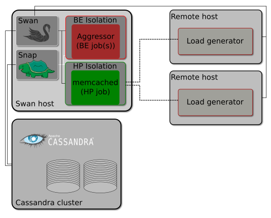

#  Swan

# Memcached Sensitivity Experiment

The first experiment bundled with Swan is a sensitivity experiment for the distributed data cache, [memcached](https://memcached.org/). The experiment enables experimenters to generate a so-called _sensitivity profile_, which describes the violation of _Quality of Service_ under certain conditions, such as CPU cache or network bandwidth interference.
Swan does this by carefully controlling execution of memcached and its co-location with aggressor processes i.e. noisy neighbors or antagonists. From this point on, _Swan_ coordinates execution of a distributed load generator called [mutilate](https://github.com/leverich/mutilate) which puts memcached under controlled load. Snap plugins and tasks are coordinated by _Swan_ to collect latency and load metrics and tags them with experiment identifiers. All the metrics are then sent to Cassandra and then extracted by Jupyter. Picture below shows the experiments components.

The memcached sensitivity experiment carries out several measurements to inspect the performance of co-located workloads on a single node. The experiment exercises memcached under several conditions and gathers _Quality of Service_ metrics like latency, so-called _Service Level Indicators (SLI), and the achieved load in terms of _Request per Second_ (RPS) or _Queries Per Second_ (QPS).

The conditions, currently, involve co-location of memcached with a list of specialized aggressors and one deep-learning workload.

## Table of Contents

1. [Theory](docs/theory.md)
1. [Prerequisites](docs/prerequisites.md)
1. [Installation](docs/installation.md)
1. [Run the Experiment ](docs/run_experiment.md)
1. [Tune Workloads](docs/tuning.md)
1. [Troubleshooting](docs/troubleshooting.md)

## Appendix

1. [Important Experiment Flags](docs/swan_flags.md)
1. [All Swan Flags](docs/config_dump_example.md)
