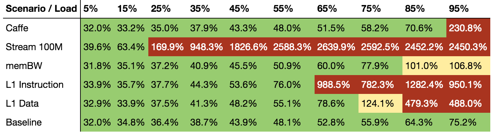

# Running the Experiment

The Sensitivity Profile Experiment can be run in two modes:

1. Standalone - Swan runs all binaries as subprocesses.
1. Kubernetes - Swan runs exercised workloads as Kubernetes Pods.

The main difference between these two, is the fact that in Kubernetes mode user can see interferences from Kubelet and Docker and compare them with Standalone mode. Also, standalone mode only requires workload binaries to be available in directories listed in `$PATH` which makes it a little bit easier to start than Kubernetes one.

Flags required for running Experiment in Kubernetes mode are in [Kubernetes Flags](swan_flags.md#Kubernetes-Flags) section.
 
To run experiment, please use `isolate-pid.sh` script that would run the binary in PID namesapce, so that all spawned processes will be cleaned in case of failure. Script and experiment binary is available inside release package.

```
./isolate-pid.sh memcached-sensitivity-profile
```
 
## Swan Flags

Swan exposes a multitude of flags for fine grained experiment control. To list all flags, plese run `memcached-sensitivity-profile -help`. To facilitate experiment preparation, we have added a "config dump" option (`memcached-sensitivity-profile -config-dump`) that could be saved to file and be used to launch experiment. An example config dump is located in [Config Dump Example](config_dump_example.md).

To facilitate experiment instrumentation, the most important Swan are listed in [Swan Flags](swan_flags.md) page.
 
Parameter flags can be used interchangeably with environment variables. Parameter takes precedence before environment variable.

## Experiment Run

First, make sure no other memcached instances or aggressors are running on the host before starting any experiments:
```bash
$ killall memcached
$ killall mutilate
$ killall l1i
$ killall l1d
$ killall l3
$ killall stream
$ killall membw
```

You can list the available command line flags by running the profile binary with `-help`:

```bash
$ make build
$ ./build/experiments/memcached/memcached-sensitivity-profile -help
```

You can start an experiment by rerunning the binary with the flags appended. For example, to change the number of cores for memcached:

```bash
$ ./build/experiments/memcached/memcached-sensitivity-profile -hp_cpus=4
```

Alternatively, you can set the option through environment variables. This tend to be useful when setting many options.
For the `--hp_cpus=` flag, the corresponding environment variable is called `SWAN_HP_CPUS`.
Assuming that you have set flags through environment variables, you can start the experiment like this:

```bash
$ ./build/experiments/memcached/memcached-sensitivity-profile
```

If you want to change the verbosity of the output, you can choose a more detailed log level:

```bash
$ ./build/experiments/memcached/memcached-sensitivity-profile -log=debug
```

When the experiment has started, you should see an [UUID](https://en.wikipedia.org/wiki/Universally_unique_identifier) like `5df7fa72-add4-44a2-67fa-31668bcafe81` which will be the identifier for this experiment and be the way to get hold of the experiment data.

### Example configuration

Below is an example configuration using environment variables to set up the experiment where the machines are configured in the following topology:

|   Machine     |                  Role                  |
|---------------|----------------------------------------|
| 192.168.10.9  | SUT node for Swan Experiment           |
| 192.168.10.3  | Load Generator agent node #1           |
| 192.168.10.4  | Load Generator agent node #2           |
| 192.168.10.5  | Load Generator agent node #3           |
| 192.168.10.6  | Load Generator agent node #4           |
| 192.168.10.10 | Services node                          |

Binaries should be installed on those machines as stated in [Installation](installation.md) guide. 

`memcached-sensitivity-profile` must be launched on the SUT node by a privileged user.
Key based ssh authorization for user `root` is required from the SUT node to the Load Generator nodes.


In this example, SUT node has 32 hyper threads over 16 physical cores on 2 sockets. Per the topology description showed in [Theory](theory.md) section, this leaves 4 threads and logical cores for memcached.
Following the 4 threads, the configuration below is configured to reach 800 concurrent connections to memcached (the calculations are provided in [Tuning Mutilate](tuning.md#Mutilate-Tuning) section). 

```bash
## --- aggressors ---
export SWAN_AGGR=l1d,l1i,stream,membw,caffe

## --- isolation ---
export SWAN_HP_CPUS=4
export SWAN_BE_CPUS=4

## --- memcached configuration ---
export SWAN_MEMCACHED_PATH=$GOPATH/src/github.com/intelsdi-x/swan/workloads/data_caching/memcached/memcached-1.4.25/build/memcached
export SWAN_MEMCACHED_IP=192.168.10.9
export SWAN_MEMCACHED_THREADS=4
export SWAN_MEMCACHED_CONNECTIONS=16000

## --- mutilate configuration ---
# master
export SWAN_MUTILATE_PATH=/usr/local/bin/mutilate
export SWAN_MUTILATE_MASTER=192.168.10.10
export SWAN_MUTILATE_MASTER_THREADS=4
export SWAN_MUTILATE_MASTER_CONNECTIONS=4
export SWAN_MUTILATE_MASTER_CONNECTIONS_DEPTH=4
export SWAN_MUTILATE_MASTER_BLOCKING=true
export SWAN_MUTILATE_MASTER_QPS=1000
export SWAN_MUTILATE_WARMUP_TIME=5s

# agent
export SWAN_MUTILATE_AGENT=192.168.10.3,192.168.10.4,192.168.10.5,192.168.10.6
export SWAN_MUTILATE_AGENT_THREADS=20
export SWAN_MUTILATE_AGENT_CONNECTIONS=10
export SWAN_MUTILATE_AGENT_CONNECTIONS_DEPTH=4
export SWAN_MUTILATE_AGENT_BLOCKING=true
export SWAN_MUTILATE_AGENT_AFFINITY=true
export SWAN_MUTILATE_AGENT_PORT=6556

## --- experiment configuration ---
export SWAN_SLO=500
export SWAN_LOAD_DURATION=15s
export SWAN_PEAK_LOAD=650000
export SWAN_LOAD_POINTS=10
export SWAN_REPS=1
export SWAN_LOG=error

## --- snap configuration
export SWAN_SNAPTELD_ADDRESS=192.168.10.9

## --- cassandra configuration
export SWAN_CASSANDRA_ADDR=192.168.10.10
export SWAN_SNAP_CASSANDRA_PLUGIN_PATH=$GOPATH/bin/snap-plugin-publisher-cassandra
```

Before running `memcached-sensitivity-profile` please ensure that
* Cassandra is up and running on the cassandra host
* Snapteld is running on SUT
* Mutilate binary is copied to proper location on mutilate hosts
* From SUT node, a privileged user can connect via ssh to Load Generator nodes using keys authorization.

If everything is up and ready then simply launch
```
memcached-sensitivity-profile
```

and explore the data.

## Explore Experiment Data (Sensitivity Profile)

When the experiment is complete, the results can be retrieved from Cassandra.
Swan ships with a Jupyter Notbook which provides an environment for loading the samples and generating sensitivity profiles.
For instructions on how to run Jupyter Notebook, please refer to the [Jupyter user guide](../../../jupyter/README.md).

A few pointers to validate the experiment data:

 - Baseline measurements should not violate SLO at any load point.
 - At low loads - numbers may not differ for baseline and co-located scenarios. The differences should be in _when_ the saturation occurs. For the co-located scenarios, this should become evident at higher loads. If this does not occur, it might mean that Memcached has not been properly baselined.

Below is an example of the sensitivity profile could be:




The _Load_ row is a percentage of the peak load which was found during _[Red lining](https://www.wikiwand.com/en/Redline)_.
A cell in a table express _SLI_ which is a 99th [percentile](https://www.wikiwand.com/en/Percentile) response time for that _Load_ in relation to _SLO_. For instance _Baseline_ for _Load_ 5% for _SLO_ 500ms tells that 99 percent of requests responded in time not greater than 160ms which is 32% of SLO time. Thus if we observe _SLI_ above 100% that means violation of _SLO_.
In the presented table Caffe and memBW are relatively weak aggressors and they lead to _SLO_ violation only on higher loads while Stream 100M is very aggressive and leads to _SLO_ violation even on low loads of memcached.

## Next
Please move to [Tuning](tuning.md) page.

To see all available flags, please look at [Config Dump Example](config_dump_example.md).
