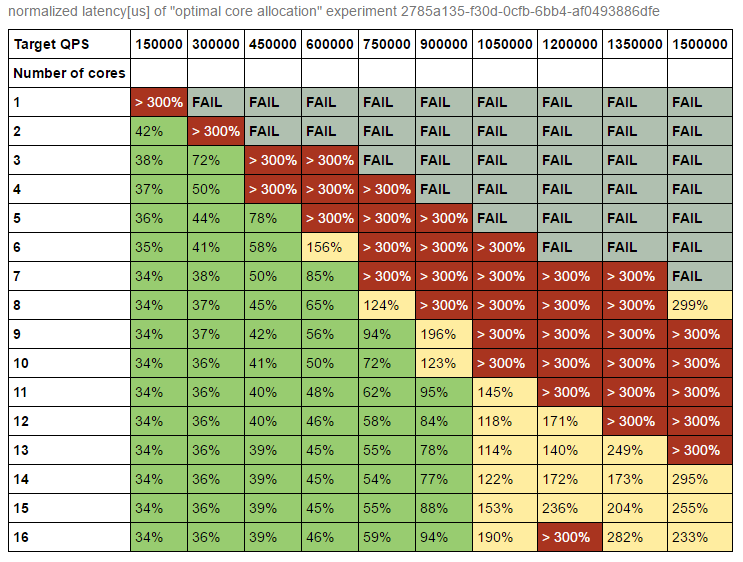
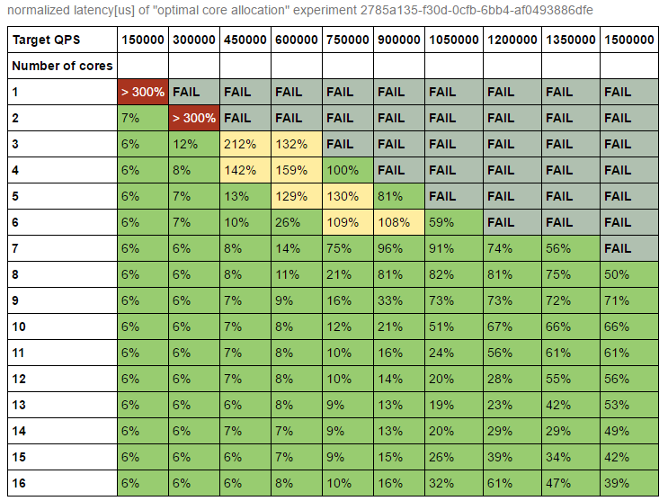
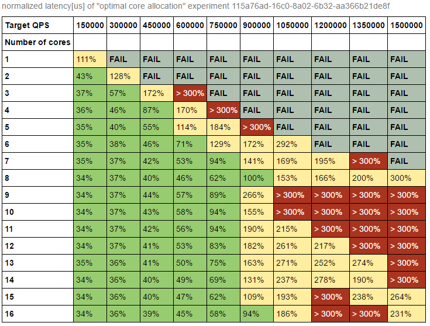
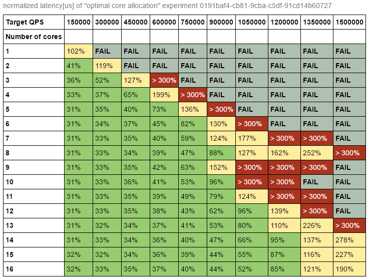
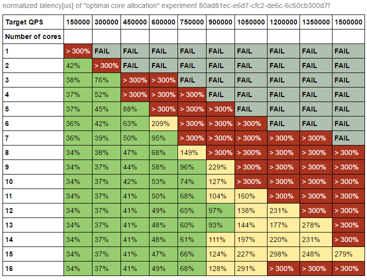
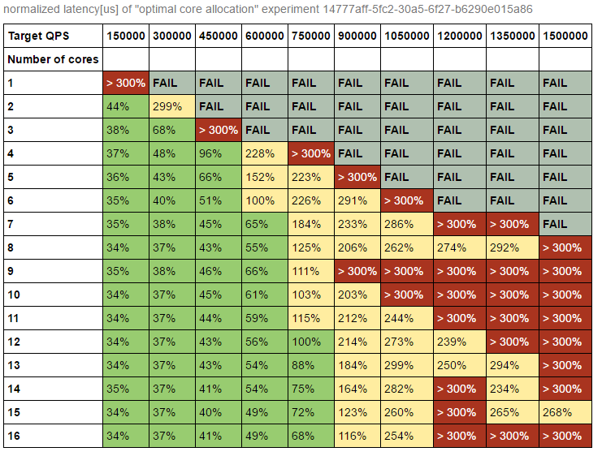

# Optimal core allocation experiment

## Rationale

This experiment allows you to find the optimal core and worker threads configuration that delivers the best performance 
in terms of throughput and guaranteeing response time for latency sensitive workloads.

The experiment uses memcached as the latency sensitive workload and tries to find optimal number of memcached worker threads (typically set with  the `-t` flag for `memcached`).

### Environment prerequisites

1. `optimal-core-allocation` experiment binary available in `$PATH`. The binary can be downloaded from [releases page](https://github.com/intelsdi-x/swan/releases) (available inside `swan.tar.gz`) along with all required [Snap](https://github.com/intelsdi-x/snap) plugins.
1. [mutilate](https://github.com/leverich/mutilate) load generator installed on load generator nodes (flags: `-experiment_mutilate_master_address`, `-experiment_mutilate_agent_addresses`).
1. Running Cassandra database with a keyspace dedicated to swan to store the experiment results (flag: `-cassandra_address`).
1. Jupyter notebook with `jupyter/generic.py` module installed (with dependencies installed from `jupyter/requirements.txt`).
1. SSH passwordless access to load generator nodes (optional; flags: `-remote_ssh_key_path`, `-remote_ssh_login`).
1. [Snap telemetry](snap-telemetry.io) daemon running on experiment node. 
1. `hyperkube` "all in one kubernetes components binary" available in `$PATH` (if you want to run the experiment on automatically provisioned Kubernetes cluster)


### Peak load

This parameter specifies desired maximum capacity for memcached. The unit is queries per second. Peak load is the only required parameter.
Its value depends on resources available. Consider following formula as a rule of thumb:

```
peak_load = number of maximum threads dedicated to memcached * 100k 
```

`number of maximum threads dedicated to memcached` is set to number of physical cores available on machine by default. It can be overridden with `-max-threads` flag.

#### How to run on single node

1. Run the experiment:

```bash
sudo optimal-core-allocation -experiment_peak_load=800000
```

2. To display results of the experiment, you need to copy `experiment id` (eg `ca24aa5d-4a88-7258-6f00-5f651b0d6515`) and pass it as a parameter to python functions on Jupyter notebook:

```python
from generic import optimal_core_allocation
optimal_core_allocation("ca24aa5d-4a88-7258-6f00-5f651b0d6515", slo=500) # 500us as latency SLO 
```

Note that you need to specify your latency SLO in microseconds.

3. (Optional) If you want see more detailed results regarding latency/throughput.

```python
from swan import Experiment, OptimalCoreAllocation
exp = Experiment("ca24aa5d-4a88-7258-6f00-5f651b0d6515")
core = OptimalCoreAllocation(exp, slo=500)
core.latency()
core.qps()
core.cpu() # if run with USE snap collector
```

#### How to run in distributed mode with custom configuration file

This example shows how to run the experiment using a configuration file.
All experiment flags can be provided using a configuration file. Command line flag `-foo_bar` is equal to `FOO_BAR` option in configuration file.

1. Generate default configuration: 

```bash
sudo optimal-core-allocation -config-dump >example-configuration.txt
```

2. Modify configuration to meet your requirements:

```bash
$EDITOR example-configuration.txt
```

3. Run experiment with your configuration:

```bash
sudo optimal-core-allocation -config example-configuration.txt
```

4. Run the experiment overriding configuration file values using flags:

```bash
sudo optimal-core-allocation -config example-configuration.txt -experiment_peak_load=800000 \
    -cassandra_address=cassandra1 \
    -experiment_mutilate_master_address=lg1 -experiment_mutilate_agent_addresses=lg2,lg3 \
    -remote_ssh_login=username -remote_ssh_key_path=/home/username/.ssh/id_rsa
```

where:

- `cassandra1` is the address of cassandra database,
- `lg*` are the names of hosts dedicated to run the load generator cluster,
- `remote_ssh_*` options pointing to the credentials (username and private key), used to deploy and run load generator cluster,

#### Other experiments variants

1. You can run the experiment with memcached threads pinned to specified number of hardware threads (`-use-core-pinning` flag).
1. You can run the experiment with memcached patch that allows to pin worker threads to single CPU (flag: `-memcached_threads_affinity` flag).
1. You can run the experiment on Kubernetes cluster (`-kubertenes*` flags). 

## Example results

### Hardware/Software configuration

- 1 node for running memcached - 8 cores, single socket Intel(R) Xeon(R) CPU D-1541 @ 2.10GHz with 32GB RAM,
- 9 nodes for load generator cluster (1 master node and 8 agents),
- Linux distribution: CentOS 7 with 4.10 Linux kernel,

### How to read results

The tables below show how memcached capacity changes when amount of worker threads grows.

Each cell displays 99% percentile latency, i.e. tail latency. Colors indicates violation (or lack of thereof) of SLO:

- green - no violation,
- yellow - tail latency between 101% and 150% of SLO, 
- red - tail latency above 150% of SLO, 
- gray - memcached was incapable of handling requested amount of QPS.

There are two dimensions:
- load (x axis) - fraction of peak load expressed in QPS (Queries Per Second)
- worker threads (y axis) - number of memcached worker threads (check memcached -t option for details).

The experiment has been run with 10 load points and peak load set to 1.5 million QPS, and SLO set to 500 us.

### Table 1. normal run default latency SLO = 500us



#### Interpreting results

You can observe, that each additional memcached worker, up to 10 on 16 CPU machine, adds capacity in terms of throughput.
Taking SLO into consideration this very configuration can handle  **900.000 QPS** while meeting tail latency requirements (equls or less than 500us). You will be able to utilize **11 threads** on the node.
Increasing number of logical threads further, doesn't improve performance and surprisingly (because of hyperthreading) can cause latency degradation.

### Table 2. normal run with SLO = 3000 us



#### Interpreting results

After increasing the accepted tail latency to 3ms there we can choose from broader range of configurations.
Less threads are necessary to handle requests, while relaxed target SLO is met.

In this case optimal configuration will utilize **7 threads** and will be capable of handling more than 1.000.000 QPS with tail latency below 3ms.

#### Discussion

The interpretation above shows that there is an trade off between throughput and latency.
Having these results available you can easily decided how many resources you need to dedicate to memcached in order to meet capacity and SLO requirements.

In tha cases described above:
- sticking to strict latency requirements (SLO 500us) 11 threads are needed to achieve 900.000 QPS
- relaxing latency requirements (SLO 3ms) it is enough to dedicate just 7 threads to achieve 1.300.000 QPS 

### Other variants of experiment results.

Examples of other expriment configurations that may allow to validate various environments:
- Limiting worker threads of memcached can prevent Linux scheduling balancing problems.
- Pinning each memcached worker thread to another CPU - to make sure, that workers are never moved moved away.
- Running experiment on Kubernetes cluster using Kubernetes isolation mechanisms.

The results can help to answer following questions: 
- Can running service in containers on Kubernetes cluster cause performance degradation?
- Is performance improvement of thread pinning worth complexity?

### Table 3. with core pinning (SLO=500us)



### Table 4. with memcached threads affinity (SLO=500us)



### Table 5. normal run but using kubernetes (SLO=500us)



### Table 6. with core pinning and using kubernetes (SLO=500us)


