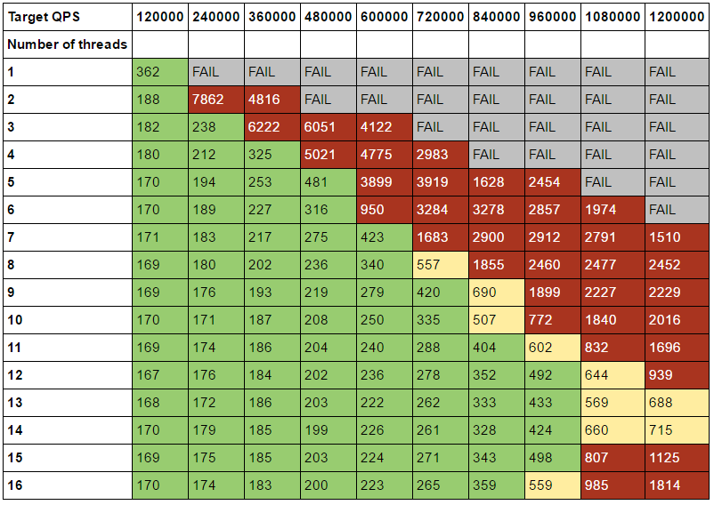
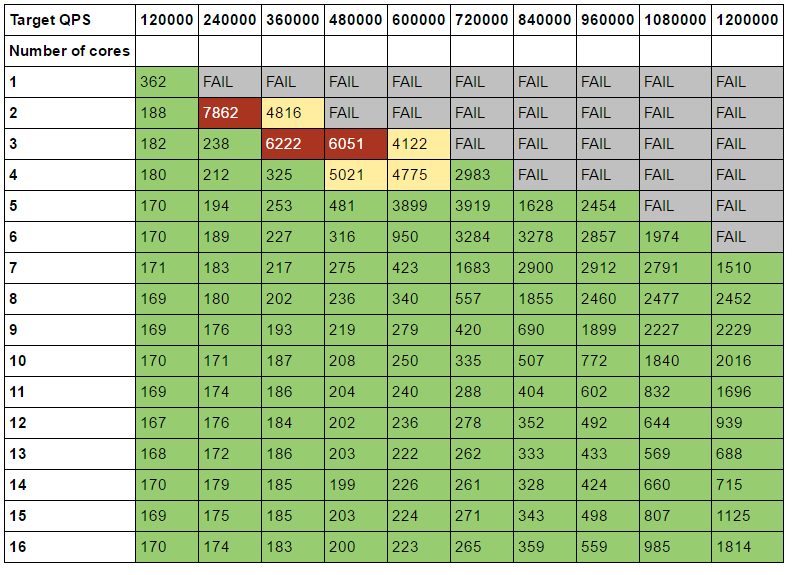
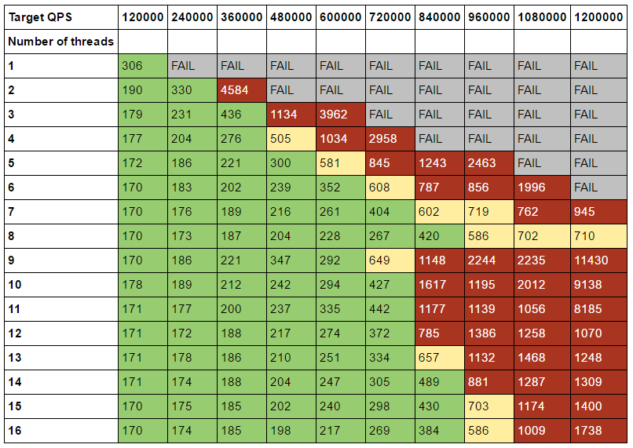
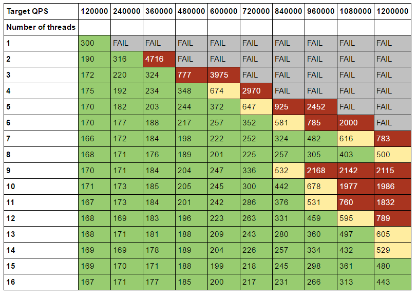
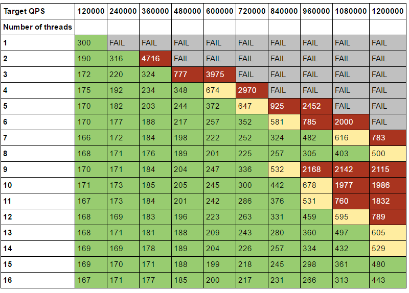

# Optimal core allocation experiment

## Rationale

This experiment allows you to find the optimal core & thread workers configuration that delivers the best performance both 
in terms of throughput and guaranteeing latency for sensitive workloads.

This example experiment uses memcached as latency sensitive workload and tries to find optimal number of memcached worker threads (-t flag).

#### Environment prerequisites.

TODO: replace common requirements for all experiments

1. Download and install in $PATH `optimal-core-allocation` experiment binary from [releases page](https://github.com/intelsdi-x/swan/releases) (available inside `swan.tar.gz`) along with all required snap plugins.
1. [mutilate](https://github.com/leverich/mutilate) load generator preinstalled on load generator nodes (flags: `-experiment_mutilate_master_address`, `-experiment_mutilate_agent_addresses`).
1. Running Cassandra database with keyspace dedicated to swan to store results (flag: `-cassandra_address`).
1. Jupyter notebook with `jupyter/generic.py` module installed (with dependencies installed from `jupyter/requirments.txt`).
1. (optional for distributed mode) ssh password-less access to load generator nodes (flags: `-remote_ssh_key_path`, `-remote_ssh_login`).
1. [Snap telemetry](snap-telemetry.io) daemon running on experiment node. 
1. (For kubernetes deployed from scratch) `hyperkube` "all in one kubernetes components binary" available on $PATH.


#### 'Peak load' option.

This parameter specifies what is expected 100% load for memcached expressed in Queries Per Second unit.
This is the only required parameter to run experiment.
It should be based on how powerful is machine where experiment is run. We advice to specify according this rule:

```
peak_load = number of maxmimum threads dedicated to memcached * 100k 
```

where `number of maximum threads dedicated to memcached` is by default set to number of physical cores available on machine (but can be overridden with `-max-threads` flag).

#### How to run on single node.

1. Run experiment:

```bash
sudo optimal-core-allocation -experiment_peak_load=800000
```

2. To print results from experiment, you need to copy `experiment id` in form of UUID e.g. `ca24aa5d-4a88-7258-6f00-5f651b0d6515`.
The ID is printed to standard output and should be used in python functions to generate result tables in Jupyter, like this:

```python
from generic import optimal_core_allocation
optimal_core_allocation("ca24aa5d-4a88-7258-6f00-5f651b0d6515", slo=500) # 500us as latency SLO 
```

Note that you need to specify your latency SLO in us unit to mark configuration that violates this SLO.

3. (Optional) If you want see more detailed results regarding latency/throughput.

```python
from generic import optimal_core_allocation_qps, optimal_core_allocation_latency, optimal_core_allocation_cpu, 
optimal_core_allocation_qps("ca24aa5d-4a88-7258-6f00-5f651b0d6515", slo=500)
optimal_core_allocation_latency("ca24aa5d-4a88-7258-6f00-5f651b0d6515")
optimal_core_allocation_cpu("ca24aa5d-4a88-7258-6f00-5f651b0d6515") # only available when run with -use_USE_collector flag
```

#### How to run in distributed mode with custom configuration file.

This example shows how to run experiment using configuration file.
All experiment flags can be provided using configuration file. Command line flag `-foo_bar` is equal to `FOO_BAR` option in configuration file.

1. Generate default configuration: 

```bash
sudo optimal-core-allocation -config-dump >example-configuration.txt
```

2. Modify configuration to meet your needs:

```bash
$EDITOR example-configuration.txt
```

3. Run experiment with provided configuration:

```bash
sudo optimal-core-allocation -config example-configuration.txt -experiment_peak_load=800000
```

4. (Optionally) Run experiment with override configuration flags.

```bash
sudo optimal-core-allocation -config example-configuration.txt -experiment_peak_load=800000 \
    -cassandra_address=cassandra1 \
    -experiment_mutilate_master_address=lg1 -experiment_mutilate_agent_addresses=lg2,lg3 \
    -remote_ssh_login=username -remote_ssh_key_path=/home/username/.ssh/id_rsa
```

where:

- `cassandra1` is address of cassandra database,
- `lg*` are the names of hosts dedicated to run load generator cluster,
- `remote_ssh_*` options pointing to credentials (username and private key), used to deploy and run load generator cluster,

#### Other experiments variants.

1. You can run this experiment with memcached processes pinned to specified number of hardware threads (`-use-core-pinning` flag). Memcached workers threads to run number of processors (equal to worker threads).
1. You can run memcached with patch responsible for pinning worker threads to specified processors (flag: `-memcached_threads_affinity` flag).
1. You can run memcached deployed by Kubernetes (`-kubertenes` flag). 

## Example results.

#### Hardware/Software configuration

- 1 node for running memcached - 8 cores, single socket Intel(R) Xeon(R) CPU D-1541 @ 2.10GHz with 32GB RAM,
- 9 nodes for load generator cluster (1 master node and 8 agents),
- Linux distribution: CentOS 7 with 4.10 Linux kernel,

### How to read results.

The tables below show how number of worker threads are able to handle provided load.

Each cell shows 99% percentile of latency (a.k.a. tail latency), with colors indicating violation of stated SLO.

Meanings of colors:
- red - indicates violate above 150% of SLO target, 
- yellow - means violation in 101-150% of target SLO, 
- green color indicating that SLO was met,
- gray marked as "FAIL", indicates that service was incapable to handle such load (number of processed QPS was below of 90%),

There are two dimensions:
- load (x axis) - fraction of peak load expressed in QPS (Queries Per Second)
- worker threads (y axis) - number of memcached worker threads (check memcached -t option for details).

Results below were run with 10 load points with peak load set to 1.5 million of QPS with SLO set to 500 us.

#### Table 1. normal run default latency SLO = 500us



##### Interpreting results

You can easily observe, each additional memcached worker up to 10 in 16 processor machine, adds extra workforce to increase capacity in terms of throughput,
but with strict requirements about latency, you also need to consider latency SLO violation and remove red and yellow cells from acceptable configuration.
So the optimal configuration to can handle **960k QPS** still guarding response times (tail latency < 500us) and which uses as little resources as possible is **12 threads**.

#### Table 2. normal run with SLO = 3000 us



##### Interpreting results

After increasing acceptable tail latency to 3ms there is more acceptable configuration we can choose from.
We can assign less threads which are capable to handle even more load, while still having assurance that our new relaxed SLO is met.

In this case optimal configuration will use **7 threads** which should be capable of handling about 1.2m QPS and with response below 3ms.

##### Discussion

The interpretation above showed us, that there is an trade of between throughput and latency.
Having those results you can easily decided how many resources you need to dedicated to your memcached instance to met both requirements (capacity and response time).

In our case:
- with strict latency requirements (SLO latency 500us) you should dedicate only 12 threads to memcache, which can guarantee 960k QPS
- having very relaxed latency requirements (SLO latency 3ms), it is enough to dedicate just 7 threads to achieve 1.2m QPS 

### Other variants of experiment results.

Running experiment in other variants like:

- limiting worker threads of memcached workers can run to prevent balancing problems,
- pinning manually each memcached worker thread - to make sure, that workers are never moved moved away,
- or running the same service in kubernetes,

allow you to validate if such options are desirable in you environment.

Results from those experiments can answer following questions: 
- is running service in containers using kubernetes as scheduler can cause degradation performance,
- is overhead and complexity of manually assigning threads  worth of performance improvement and to what extent, 

If you care about your infrastructure utilization you should generate additional table to see compute power utilization (CPU)
and decide how good you current setup fit your workloads needs.

#### Table 3. with core pinning (SLO=500us)



#### Table 4. with memcached threads affinity (SLO=500us)



#### Table 5. normal run but using kubernetes (SLO=500us)


