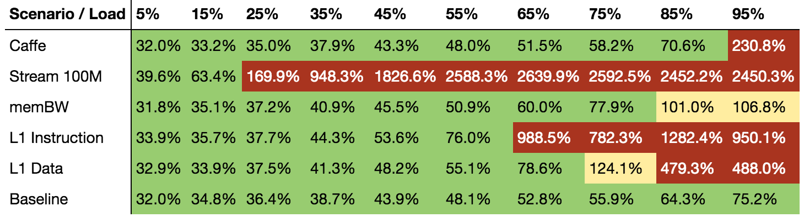
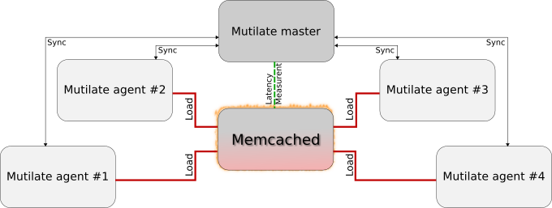

# Memcached sensitivity experiment

The first experiment which comes with Swan is a sensitivity experiment for the distributed data cache, [memcached](https://memcached.org/). The experiment enables experimenters to generate a so-called sensitivity profile, which describes the violation of Quality of Service under certain conditions, such as cpu cache or network bandwidth interference.
An example of this can be seen below.



Swan does this by carefully controlling execution of memcached and its co-location with aggressor processes i.e. noisy neighbors or antagonists. From this point on, Swan coordinates execution of a distributed load generator called [mutilate](https://github.com/leverich/mutilate). Snap plugins and tasks are coordinated by swan to collect latency and load metrics and tags them with experiment identifiers.


The memcached sensitivity experiment carries out several measurements to inspect the performance of co-located workloads on a single node. The experiment exercises memcached under several conditions and gathers Quality of Service metrics like latency, so-called Service Level Indicators or SLI for short, and the achieved load in terms of Request per Second (RPS) or Queries Per Second (QPS).

The conditions, currently, involve co-location of memcached with a list of specialized aggressors and one deep-learning workload.

## Prerequisites

While the experiment can be run in a developer setting from within a virtual machine or on your own laptop, the experiment is targeted a data center environment with high bandwidth links and rich multi socket servers. It can be a surprisingly tricky exercise to rule out unintended sources of interference in these experiments, so below is a guide to setting up the experiment and some guidance in how to debug a misbehaving setup.

### Snap

Swan use Snap to collect and process i.e. tag metrics, and store them in Cassandra. Swan does not stand up a Snap cluster, as users may already have this installed and set up in [tribes](https://github.com/intelsdi-x/snap/blob/master/docs/TRIBE.md) on machines in the cluster.

See the [Snap installation guide](https://github.com/intelsdi-x/snap) for guidance of how to configure and install `snapd`. `snapd` should be running on the host running the swan binary.

### Cassandra

Another dependency is a running Cassandra cluster. Again, it is out of the scope for Swan to stand up Cassandra and use of a shared Cassandra cluster is recommended. See [Datastax's installation guide](http://docs.datastax.com/en/cassandra/3.x/cassandra/cassandraAbout.html) for information about how to install and operate Cassandra clusters. It is not recommended that any of the machines involved in the experiment (executing memcached or load generators) are running Cassandra, in order reduce any unintended interference. For development purposes, you can start Cassandra from a docker container with:

```
docker run -d -p :9042:9042 -p :9160:9160 cassandra
```

**NOTE** Running Cassandra in docker containers is not advised for production environments.
Additionally, be careful if not used with docker volume mounts as you may experience data loss.

**NOTE** The [Cassandra Snap publisher](https://github.com/intelsdi-x/snap-plugin-publisher-cassandra) is required for Swan to publish metrics to Cassandra. This repository may require explicit added access. Contact GitHub administrators of http://github.com/intelsdi-x to get access to this repository.

### Validation

It is recommended to ensure that all integration tests are working on your machine before running experiment.
After following the steps in the [Swan installation guide](../docs/install.md), run:

```bash
$ make integration_test
```

## Configuration and tuning

As the experiments measures sub-millisecond response times, there are a myriad of sources of interference which silently can cause misleading measurements.
To get insight into some of these, please refer to [Kozyrakis, Jacob Leverich Christos. "Reconciling High Server Utilization and Sub-millisecond Quality-of-Service"](http://citeseerx.ist.psu.edu/viewdoc/download?doi=10.1.1.713.5120&rep=rep1&type=pdf).

Much of the configuration guidelines here are targeted eliminating as many of these (unintentional) sources of interference as possible.

Swan has built in performance isolation patterns to focus aggressors on the sources of interference they are intended to stress.
However, Swan needs some input from the user about the environment to adjust these. The sections below will go over the recommended

### Machine configuration

We recommend the following machine topology:

| Type                  | Description                                                                                                                               | Machine                                                                                |
|-----------------------|-------------------------------------------------------------------------------------------------------------------------------------------|----------------------------------------------------------------------------------------|
| Target machine        | Machine where swan is run and thus where memcached will be run. Snapd should be running on this host as well.                             | 1 x 10Gb link, hyper threaded with 16 or more hyper threads, preferably with 2 sockets |
| Load generator master | Machine where mutilate master will be running and thus the machine which coordinates all mutilate agent machines.                         | 1 x 10Gb link, 20 or more hyper threads in total                                       |
| Load generator agents | Machines to generate stress on the target machine.                                                                                        | 4 x 10Gb link, 20 or more hyper threads in total                                       |
| Service machines      | Machines where Cassandra and Jupyter will run. The 'cleaniness' of this machine is less important than target and load generator machines. | 1 x 1-10Gb link, higher memory capacity to accommodate for Cassandra heap usage.       |


#### File descriptors

As the both mutilate and memcached will create many connections, it is important that the number of available file descriptors is high enough. It should be in the high 10.000s.
To check the current limit, run:

```bash
$ ulimit -n
256
```

and set a new value with:

```bash
$ ulimit -n 65536
```

#### DDoS protection

Sometimes, the Linux kernel applies anti-denial of service measures, like introducing [TCP SYN cookies](https://en.wikipedia.org/wiki/SYN_cookies). This will break the mutilate load generators and should be turned off on the target machine:

```bash
$ sudo sysctl net.ipv4.tcp_syncookies=0
```

#### Power control

To avoid power saving policies to kick in while carrying out the experiments, set the power governor policy to 'performance':

```bash
$ sudo cpupower frequency-set -g performance
```

#### Misc

In general, look at all running processes at the mutilate master, agents and on the target machine. Try to reduce the number of processes running at any time to reduce the likelihood of interference.
memcached and mutilate are sensitive to processes which use any network bandwidth and otherwise may interfere with normal execution speed. Example of these are tracing tools like `iftop`. Therefore, be cautious using instrumentation tools while conducting experiments.

### memcached configuration

One of the most important configuration options for memcached is the thread count. We recommend _half physical core count per socket_. In a machine with 32 hyper threads over 16 cores and 2 sockets, this equals 4 memcached threads.
This is set with the `--memcached_threads` flag or through the `SWAN_MEMCACHED_THREADS` environment variable.
The rationale for this number is explained in the 'Isolation configuration' section below.
Lastly, the maximum number of connections to memcached can be set with the `--memcached_connections` flag or through the `SWAN_MEMCACHED_THREADS` environment variable.

### Isolation configuration

To give insight into the placement of aggressor workloads, and motivate the thread count selection in memcached, let us start with an example topology:


Using half the number of physical cores on one socket leaves us with 1 memcached thread:


We do this, partly so we can introduce isolated aggressors on the L1 caches:


_and_ introduce L3 aggressors with the same setup of memcached, in order to compare latency measurements between both aggressor types:


Swan will by default try to aim for the core configuration above.
Swan does this by creating separate exclusive [cgroup cpu sets](https://www.kernel.org/doc/Documentation/cgroup-v1/cpusets.txt) for the high priority and best effort processes.
By creating exclusive cpu sets, Swan can reduce interference from other background processes which may get scheduled on the high priority cores.

Using exclusive cpu sets can be challenging if other systems on the host are using cpu sets. Exclusive cpu sets cannot share cores with any other cgroup and setting the desired cores will cause an error from the kernel.
An example of such conflicting and potential overlapping cpu sets could be systems with [docker](https://www.docker.com/) installed. Docker creates a cpuset cgroup which contain all logical cores and thus will conflict with Swan, if Swan attempts to create exclusive cpu sets.

### Aggressor configuration

| Source of interference | Aggressor description (from [ibench paper](http://web.stanford.edu/~cdel/2013.iiswc.ibench.pdf)) |
|------------------------|-----------------------|
| L1 instruction         | "A simple kernel that sweeps through increasing fractions of the i-cache, until it populates its full capacity. Accesses in this case are again random." |
| L1 data                | "A copy of the previous SoI (Source of Interference), tuned to the specific structure and size of the d-cache (typically the same as the i-cache)." |
| L3 data                | "The kernel issues random accesses that cover an increasing size of the LLC capacity" |
| Memory bandwidth       | "The benchmark in this case performs streaming (serial) memory accesses of increasing intensity to a small fraction of the address space" |
| Stream                 | Another [well-known](https://www.cs.virginia.edu/stream/) memory bandwidth benchmark. |

To ensure a proper intensity of the aggressors, we recommend running as many threads of the aggressors as memcached.
For L1 aggressors, this means running on all logical sibling cores and one physical core per L3 aggressor.

For more information, please refer to [Delimitrou, Christina, and Christos Kozyrakis. "ibench: Quantifying interference for datacenter applications." Workload Characterization (IISWC), 2013 IEEE International Symposium on. IEEE, 2013.](http://web.stanford.edu/~cdel/2013.iiswc.ibench.pdf).

### mutilate configuration

Swan ships with mutilate as it's load generator for memcached. It has previously been used in [published latency studies for memcached](http://csl.stanford.edu/~christos/publications/2014.mutilate.eurosys.pdf) and is a distributed high-performance load generator.

When running mutilate in a distributed setup, the master process (or coordinator) connects to the target memcached instance in conjunction with the load being generated by the agents. Below, the master connection is highlighted with green and the main load from the agents is highlighted with red.



In this way, the mutilate master continuously communicates the target per-agent load, gets achieved load back and performs latency readings on samples connections it establish to the memcached instance directly.

When configuring the mutilate cluster, one central aspect is the _number of concurrent connections_ to memcached.
It is recommended to aim for 100-200 connections per memcached server thread.

For mutilate, agents should establish significantly less than 100 connections per mutilate thread. Aiming for somewhere between 5-15 should be doable.
Also, the mutilate agent thread count should not exceed the number of logical cores on the machine.

The math is then as follows:

```
Total connections = number of agents x number of agent threads x agent connection count
```

For a memcached instance with 4 threads, we can aim for 800 concurrent connection:
```
4 agents x 20 threads x 10 connections = 800 concurrent connections
```

The above is configured with the following flags:
```
--mutilate_agent_threads=8    Mutilate agent threads (-T).
--mutilate_agent_port=5556    Mutilate agent port (-P).
--mutilate_agent_connections=1  
                              Mutilate agent connections (-c).
--mutilate_agent_connections_depth=1  
                              Mutilate agent connections (-d).
--mutilate_agent_affinity     Mutilate agent affinity (--affinity).
--mutilate_agent_blocking     Mutilate agent blocking (--blocking -B).
--mutilate_master_threads=8   Mutilate master threads (-T).
--mutilate_master_connections=4  
                              Mutilate master connections (-C).
--mutilate_master_connections_depth=4  
                              Mutilate master connections depth (-C).
--mutilate_master_affinity    Mutilate master affinity (--affinity).
--mutilate_master_blocking    Mutilate master blocking (--blocking -B).
--mutilate_master_qps=1000    Mutilate master QPS value (-Q).
```

In essence, it is unfortunately very easy to see high latency measurements due to unintended interference and client side queuing in mutilate.
On top of the recommendations, we have found that reducing the number agent threads and connections and increasing the measurement time to around 30 seconds with the `--load_duration` flag helps.
To accommodate for the fewer connections per agent, you can safely add more agents.

Another option to increase precision of the latency measurements, mutilate gives the option to use blocking vs non-blocking IO. Enabling this increase the precision but increase the cpu load on the mutilate agents.

#### Known issues with mutilate

There may be issues with synchronization between the master and agents. If any of master or agents reports `out of sync`, all processes and the measurement have to be restarted.

If you see `connection closed by peer` on the agents, this is most likely related to the SYN cookies mentioned above.

### Red lining

In order to produce a sensitivity profile, Swan needs to know the peak load for memcached.
From the peak load, Swan computes load points from 5% to 100%.

Swan ships with a tuning step where swan use the `--search` capability in mutilate to find the highest load point which is under the given SLO (us latency for the specified percentile).

If you want to hold the peak capacity fixed. You can use the mutilate's `--scan` feature to find the peak capacity manually and specify

Roughly 100k-200k QPS per thread at peak

## Running

First, make sure no memcached instances or aggressors are running on the host before starting any experiments:
```bash
$ killall memcached
$ killall l1i
$ killall l1d
$ killall l3
$ killall stream
$ killall membw
```

You can list the available command line flags by running the profile binary with `--help`:

```bash
$ make build
$ ./build/experiments/memcached/memcached-sensitivity-profile --help
```

You can start an experiment by rerunning the binary with the flags appended. For example, to change the number of cores for memcached:

```bash
$ ./build/experiments/memcached/memcached-sensitivity-profile --hp_cpus=4
```

Alternatively, you can set the option through environment variables. This tend to be useful when setting many options.
For the `--hp_cpus=` flag, the corresponding environment variable is called `SWAN_HP_CPUS`.
Assuming that you have set flags through environment variables, you can start the experiment like this:

```bash
$ ./build/experiments/memcached/memcached-sensitivity-profile
```

If you want to change the verbosity of the output, you can choose a more detailed log level:

```bash
$ ./build/experiments/memcached/memcached-sensitivity-profile --log=debug
```

When the experiment has started, you should see a [UUID](https://en.wikipedia.org/wiki/Universally_unique_identifier) like `5df7fa72-add4-44a2-67fa-31668bcafe81` which will be the identifier for this experiment and be the way to get hold of the experiment data.

## Explore experiment data

While the experiment is running, you can access the experiment data in Cassandra.
Swan ships with a Jupyter setup which provides an environment for loading the samples and generating sensitivity profiles.
For instructions on how to run Jupyter, please refer to the [Jupyter user guide](../../scripts/jupyter/README.md).

A few pointers to validate the experiment data:

 - Baseline measurements should not violate SLO at any load point.
 - At low loads, don't worry - numbers may not differ for baseline and co-located scenarios. The differences should be in _when_ you see saturation. For the co-located scenarios, this should become evident at higher loads.
 - Verify the achieved load. If mutilate has been misconfigured or is overloading memcached, the target QPS may divert significantly from the actual QPS.

Below is an example of the sensitivity profile could be:


## Example configuration

Below is an example configuration using environment variables to set up the experiment where the machines are configured in the following topology:

|   Machine     |                  Role                  |
|---------------|----------------------------------------|
| 192.168.10.9  | Target host running `snapd` and `swan` |
| 192.168.10.1  | Mutilate master host                   |
| 192.168.10.3  | Mutilate agent host #1                 |
| 192.168.10.4  | Mutilate agent host #2                 |
| 192.168.10.5  | Mutilate agent host #3                 |
| 192.168.10.6  | Mutilate agent host #4                 |
| 192.168.10.10 | Service host running Cassandra         |

The target host has 32 hyper threads over 16 physical cores on 2 sockets. Per the topology description above, this leaves 4 threads and logical cores for memcached.
Following the 4 threads, the configuration below is configured to reach 800 concurrent connections to memcached (same calculation as in the mutilate configuration section above).

```bash
## --- aggressors ---
export SWAN_AGGR=l1d,l1i,stream,membw,caffe

## --- isolation ---
export SWAN_HP_EXCLUSIVE_CORES=true
export SWAN_BE_EXCLUSIVE_CORES=true
export SWAN_HP_CPUS=4
export SWAN_BE_CPUS=4
export SWAN_NICE=0

## --- memcached configuration ---
export SWAN_MEMCACHED_PATH=$GOPATH/src/github.com/intelsdi-x/swan/workloads/data_caching/memcached/memcached-1.4.25/build/memcached
export SWAN_MEMCACHED_IP=192.168.10.9
export SWAN_MEMCACHED_THREADS=4
export SWAN_MEMCACHED_CONNECTIONS=16000

## --- mutilate configuration ---
# master
export SWAN_MUTILATE_PATH=/usr/local/bin/mutilate
export SWAN_MUTILATE_MASTER=192.168.10.1
export SWAN_MUTILATE_MASTER_THREADS=4
export SWAN_MUTILATE_MASTER_CONNECTIONS=4
export SWAN_MUTILATE_MASTER_CONNECTIONS_DEPTH=4
export SWAN_MUTILATE_MASTER_BLOCKING=true
export SWAN_MUTILATE_MASTER_QPS=1000
export SWAN_MUTILATE_WARMUP_TIME=15s

# agent
export SWAN_MUTILATE_AGENT=192.168.10.3,192.168.10.4,192.168.10.5,192.168.10.6
export SWAN_MUTILATE_AGENT_THREADS=20
export SWAN_MUTILATE_AGENT_CONNECTIONS=10
export SWAN_MUTILATE_AGENT_CONNECTIONS_DEPTH=4
export SWAN_MUTILATE_AGENT_BLOCKING=true
export SWAN_MUTILATE_AGENT_AFFINITY=true
export SWAN_MUTILATE_AGENT_PORT=6556

## --- experiment configuration ---
export SWAN_SLO=500
export SWAN_LOAD_DURATION=15s
export SWAN_PEAK_LOAD=650000
export SWAN_LOAD_POINTS=10
export SWAN_REPS=1
export SWAN_LOG=error

## --- snap configuration
export SWAN_SNAPD_ADDR=192.168.10.9

## --- cassandra configuration
export SWAN_CASSANDRA_ADDR=192.168.10.10
export SWAN_SNAP_CASSANDRA_PLUGIN_PATH=$GOPATH/bin/snap-plugin-publisher-cassandra
```
