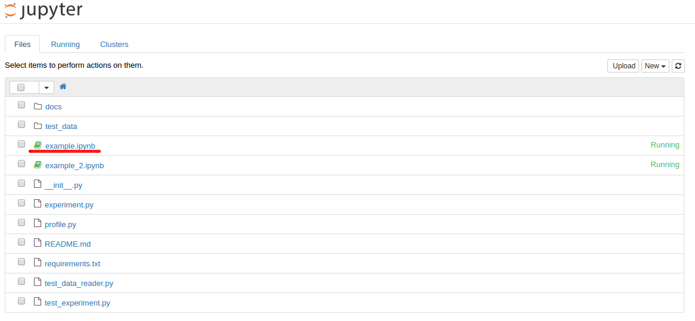
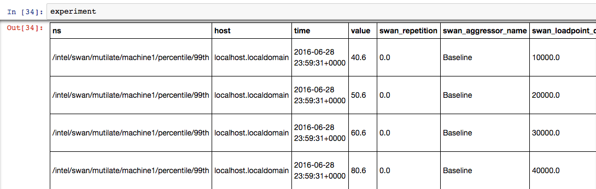
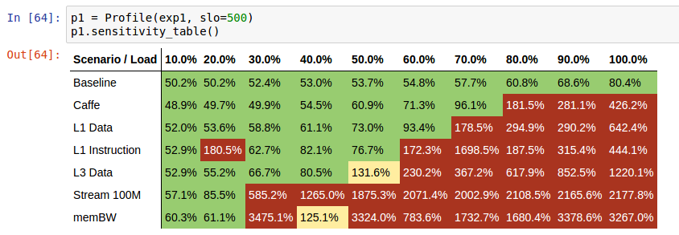
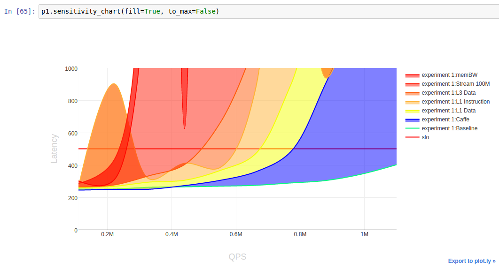
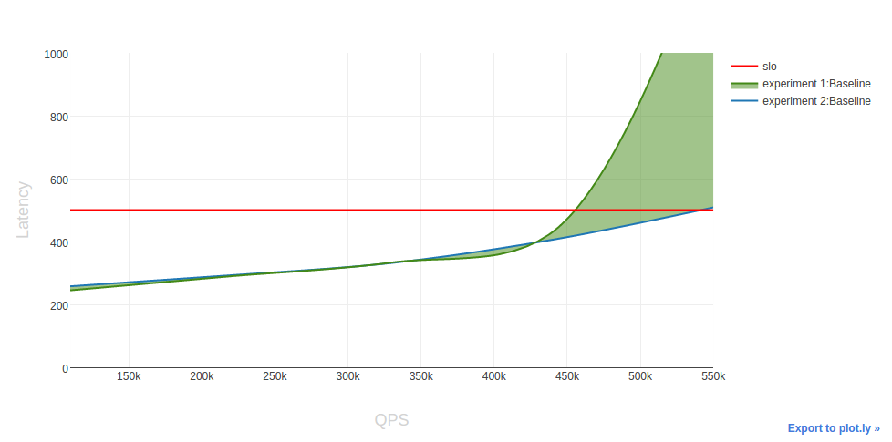

# Jupyter experiment viewer

## Introduction

*"The Jupyter Notebook is a web application that allows you to create and share documents that contain live code, equations, visualizations and explanatory text. Uses include: data cleaning and transformation, numerical simulation, statistical modeling, machine learning and much more."* [from jupyter.org](http://jupyter.org/)

Swan uses *Jupyter Notebook* to filter, process and visualize results from experiments. 

## Installation

In order to install Jupyter first `python` and `pip` need to be installed.
On Centos 7 installation of those packages can be achieved by:

```sh
sudo yum install python-pip python-devel
```

or following the instructions at [official pip site](https://pip.pypa.io/en/stable/installing/#installing-with-get-pip-py)

After `python` and `pip` are installed Jupyter can be installed by typing:

```sh
make deps_jupyter
```
in the Swan main directory.

## Launching Jupyter

In order to start Jupyter enter `jupyter` directory in Swan repository and type:

```sh
jupyter notebook
```

Jupyter will start locally. Using web browser visit the http://127.0.0.1:8888 address to access Jupyter notebooks.


## Explore example Jupyter Notebook

From within the Jupyter web interface, open a template notebook by clicking on `example.ipynb`:



This is very simple notebook that will generate only sensitivity profile for the experiment.
The first step is to set the following variables:
- `IP` and `PORT` which shall point to the Cassandra database to which experiment's results and metadata was written 
- `EXPERIMENT_ID` is the identifier of the experiment which will be examined

After filling the variables nagivate the green box using keyboard arrows so that it points to the first variable and press `[Shift] [Enter]` to evaluate it. Evaluation actually means executing the code in the box. Evaluate further and observe the output. `Experiment` object's construction 

```python
# An experiment can now be loaded from the database by its ID.
exp1 = Experiment(cassandra_cluster=[IP], 
                  experiment_id=EXPERIMENT_ID_SWAN, port=PORT, name="experiment 1")
```


may take a while since it will retrieve data from Cassandra and store them in the variable `exp1` which represents itself as a table:



The last two steps are to render sensitivity profile from the loaded samples and draw sensitivity chart. The former will be generated after evaluating:

```python
p = Profile(exp1, slo=500)
p.sensitivity_table()
```

Where `slo` is the target latency in micro seconds.. Rendered table, which is the *Sensitivity Profile*, will look similar to the one below:



To learn more about *Sensitivity Profile* read the [Sensitivity Experiment](../experiments/memcached-sensitivity-profile/README.md) README.

## Visualizing data using Jupyter

We are using [plotly](https://plot.ly/) interactive plots. To render *Sensitivity char* from a profile use the following method:

```python
p1.sensitivity_chart(fill=True, to_max=False)
```

*Sensitivity chart* will show how aggressors interference with HP job.



The chart shows *Sensitivity profile* in the form of a graph. The red horizontal line is the SLO which shall not be violated. Below the SLO line there is a Baseline and for all load points it should stay there. For Baseline there must not be any SLO violation. HP with various aggressors cases may start below SLO but will exceed it at some load point increasing rapidly.


The `fill` parameter to the `sensitivity_chart()` controls whether fills the area between Baseline and aggressors. `to_max` shows a comparison between baseline and the 'worst case', which for each load point takes the highest latency from all HP with aggressor.


It is also possible to compare two experiments (examine `example_2.ipynb`):

```python
exps = [exp1, exp2]
compare_experiments(exps, fill=True, to_max=False)
```

Here `fill` parameter acts the same as in the previous example, and `to_max` compares baseline for two experiments.



At this chart the "green area" shows improvement in terms of higher load and lower latency, between `Baselines` on two different setups.

## Exploration data using Jupyter Notebooks

To get started, we have provided an exemplary notebooks [example.ipynb](example.ipynb) and [example_2.ipynb](example_2.ipynb).

Because of [plotly](https://plot.ly/) usage, we recommend open example from the local Jupyter instance.
