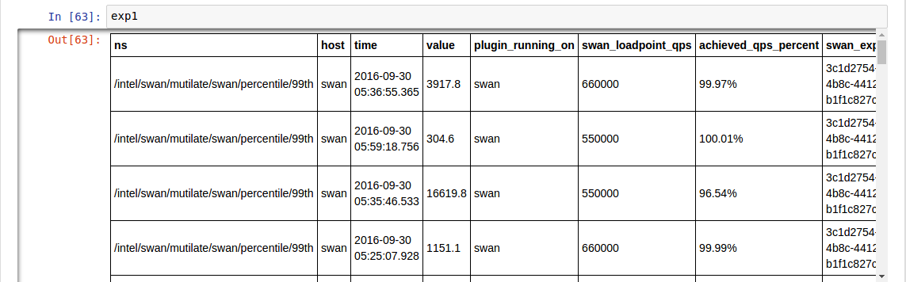
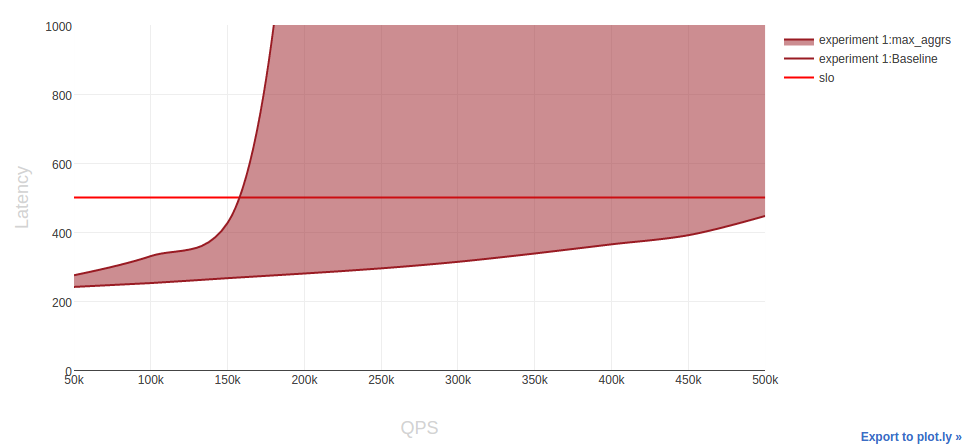

# Jupyter experiment viewer

## Installation

`python` and `pip` are necessary dependencies for Jupyter.
On Centos 7, install the following packages with:

```sh
sudo yum install python-pip python-devel
```

or follow the instructions at [official pip site](https://pip.pypa.io/en/stable/installing/#installing-with-get-pip-py)

After this, install the python dependencies with `make`:

```sh
make deps_jupyter
```

## Launching Jupyter

Start Jupyter by running the following in the `swan/scripts/jupyter` directory:

```sh
jupyter notebook --ip=0.0.0.0
```

If run locally, the command will bring up the default browser.
If not, connect to http://hostname:8888/ through your browser.

## Explore data using Jupyter

From within the Jupyter interface, open a template notebook by clicking on `Open` and `example.ipynb`, or you can open a new notebook like below:


Within the open template notebook:
- set the `IP`, `PORT` of Cassandra cluster and `EXPERIMENT_ID`
- select the first `import` python statement:

```python
from experiment import *
```

And evaluate the expressions by clicking `shift` and `enter` on the cell.

```python
exp = Experiment(cassandra_cluster=['localhost'], experiment_id='uuid of experiment', port=9042)
```

Code above shows the available samples. Be aware that if a experiments contains a large amount of data, this can take a minute:



If you want to get [pandas](http://pandas.pydata.org/) DataFrame from `exp` for deeper analysis, you can get it by:
```python
df1 = exp1.get_frame()
```

To render a sensitivity profile from the loaded samples, run:

```python
p = Profile(exp, slo=500)
p.sensitivity_table(show_throughput=False)
```

Where `slo` is the target latency in micro seconds and `show_throughput` is an optional parameter which shows the work carried out by the best effort workload.

This should render a table similar to the one below:


The figure above shows the impact of interference on shared resources for the latency critical task.
The first row in the table represents a baseline, where the latency sensitive task is run without any aggressors, which is `Memcached` in our case.
The rest of the rows shows the impact of `aggressors` for the experiment.

Each column in the table is a so called `load point`.
The latencies are normalized to the SLO (provided in the `sensitivity_table` function).

The green color means that interference impact from aggressors was acceptable, red or yellow color shows that SLO latency was violated.

## Visualizing data using Jupyter

We are using [plotly](https://plot.ly/) interactive plots. There are some prepared function for plotting
the data directly in Jupyter, like:

```python
p1.sensitivity_chart(fill=True, to_max=False)
```

Where `fill` parameter fills the area between Baseline and selected aggressor.
`to_max` shows a comparison between baseline and the 'worst case'.
'worst case' indicates the maximum latency violation, for all aggressors at each load point.



The plot below can be provide insights, like:
- The aggressor causing SLO violations and how much do it violates the desired performance.
- The maximum load, in terms of `QPS`, which can be achieved while maintaining the SLO. The point on the X axis - where the `slo` boundary line and `aggressor` line intersect.


It is also possible to compare two experiments:

```python
exps = [exp1, exp2]
compare_experiments(exps, fill=True, to_max=False)
```

Here `fill` parameter acts the same as in the previous example, and `to_max` compares baseline for two experiments.


At this chart the "green area" shows improvement in terms of higher load and lower latency, between `Baselines` on two different setups.

## Exploration data using Jupyter

To get started, we have provided an example notebook [here](example.ipynb)

Because of [plotly](https://plot.ly/) usage, we recommend open example from the local Jupyter instance.
