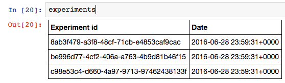

# Jupyter experiment viewer

## Installation

You need `python` and `pip` to install the necessary dependencies for Jupyter.
On Centos 7, install the following packages with:

```sh
sudo yum install python-pip python-devel
```

After this, install the python dependencies with `pip` with:

```sh
sudo pip install -r requirements.txt
```

## Launching jupyter

Start Jupyter by running the following in the `swan/scripts/jupyter` directory:

```sh
jupyter notebook --ip=111.222.333.444
```
**NOTE** Remember to replace `111.222.333.444` with the IP of the host.

From that point on, you should be able to navigate to [http://111.222.333.444:8888/](http://111.222.333.444:8888/)

## Explore data using Jupyter

First, import the experiments module:

```
from experiments import *
```

Then, connect to the Cassandra database and load the list of experiments:

```
experiments = Experiments(['address to Cassandra server'])
```
From here, you can list the available experiments by simply having Jupyter render it:


To load the available samples for an experiment, run:
```
experiment = experiments.experiment('uuid of experiment')
```

Showing the available samples can be done in the similar manner:


To render a sensitivity profile from the loaded samples, run:
```
profile = experiment.profile(500)
```

Where 500 is the target latency in micro seconds.

This should render a table similar to the one below:


