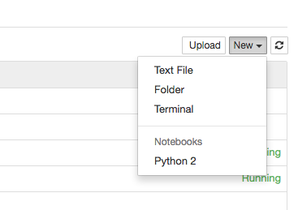
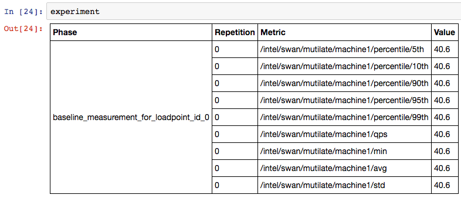
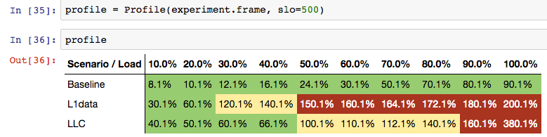

# Jupyter experiment viewer

## Installation

You need `python` and `pip` to install the necessary dependencies for Jupyter.
On Centos 7, install the following packages with:

```sh
sudo yum install python-pip python-devel
```

After this, install the python dependencies with `make` with:

```sh
make build_jupyter
```

## Launching jupyter

Start Jupyter by running the following in the `swan/scripts/jupyter` directory:

```sh
jupyter notebook --ip=0.0.0.0
```

If run locally, the command will bring up the default browser.
If not, connect to http://hostname:8888/ through your browser.

## Explore data using Jupyter

From within the Jupyter interface, open a template notebook by clicking on `Open` and `example.ipynb`, or you can open a new natebook like below:



Within the open tamplate notebook:
- set the `IP`, `PORT` of cassandra cluster and `EXPERIMENT_ID`
- focus on first `import` python statement:

```
from experiment import *
```

And evaluate the expressions by clicking shift and enter on each other.
```
exp = Experiment(cassandra_cluster=['localhost'], experiment_id='uuid of experiment', port=9042)
```

Code above shows the available samples. Be aware that if a experiments has large data, it can take a while:



To render a sensitivity profile from the loaded samples, run:
```
Profile(exp, slo=500)
```

Where 500 is the target latency in micro seconds.

This should render a table similar to the one below:


