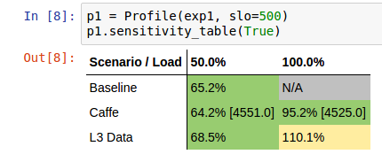

# Jupyter experiment viewer

## Installation

You need `python` and `pip` to install the necessary dependencies for Jupyter.
On Centos 7, install the following packages with:

```sh
sudo yum install python-pip python-devel
```
or follow the instructions at [official pip site](https://pip.pypa.io/en/stable/installing/#installing-with-get-pip-py)

After this, install the python dependencies with `make` with:

```sh
make deps_jupyter
```

## Launching jupyter

Start Jupyter by running the following in the `swan/scripts/jupyter` directory:

```sh
jupyter notebook --ip=0.0.0.0 --port=8080
```

If run locally, the command will bring up the default browser.
If not, connect to http://hostname:8080/ through your browser.

## Explore data using Jupyter

From within the Jupyter interface, open a template notebook by clicking on `Open` and `example.ipynb`, or you can open a new natebook like below:


Within the open tamplate notebook:
- set the `IP`, `PORT` of cassandra cluster and `EXPERIMENT_ID`
- focus on first `import` python statement:

```python
from experiment import *
```

And evaluate the expressions by clicking `shift` and `enter` on the cell.
```python
exp = Experiment(cassandra_cluster=['localhost'], experiment_id='uuid of experiment', port=9042)
```

Code above shows the available samples. Be aware that if a experiments has large data, it can take a while:


If you want to get [pandas](http://pandas.pydata.org/) DataFrame from `exp` for deeper analysis you can get it like: 
```python
df1 = exp1.get_frame()
```
To render a sensitivity profile from the loaded samples, run:
```python
p = Profile(exp, slo=500)
p.sensitivity_table(show_throughput=False)
```

Where `slo` is the target latency in micro seconds and `show_throughput` is optional parameter and consists of work make by aggressor.

This should render a table similar to the one below:


Below some missing data is shown. It can happen, if you will try build sensivity profile in case of missing data in Cassandra.
In this case field in the table is marked as grey with `N/A`

```python
p1 = Profile(exp, slo=500)
p1.sensitivity_table(show_throughput=True)
```


## Visualizing data using Jupyter

We are using [plotly](https://plot.ly/) interactive plots. There are some already prepared function for plotting
the data directly in Jupyter, like:

```python
p1.sensitivity_chart(fill=True, to_max=False)
```
Where `fill` parameter fills area between Baseline and  selected aggressor. `to_max` shows comparison between Baseline and a 'worst case'.

'worst case' in this case means max latency violations, for all aggressors at each load point.


It is also possible to compare two experiments, like below:
```python
exps = [exp1, exp2]
compare_experiments(exps, fill=True, to_max=False)
```


Here `fill` param acts the same as in the previous example, and `to_max` compares Baseline for two experiments with 'worst cases'.

## Exploration data using jupyter

To quick start we provide you with the example notebook [here](example.ipynb)

Note: Unfortunately Github doesn't render iframes at the moment.
So, you will notice, that plotly graphs do not show up on the page after rendering.
We recommend use [nbviewer](http://nbviewer.jupyter.org/) which renders every notebooks from Github, on a separate domain,
or just open example from the local Jupyter instance.
