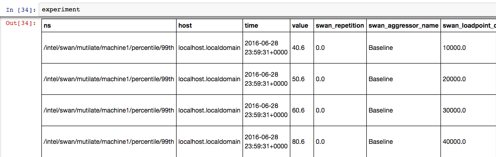
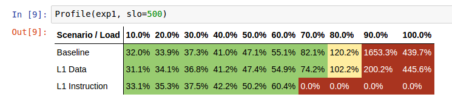

# Jupyter experiment viewer

## Installation

You need `python` and `pip` to install the necessary dependencies for Jupyter.
On Centos 7, install the following packages with:

```sh
sudo yum install python-pip python-devel
```
or follow the instructions at [official pip site](https://pip.pypa.io/en/stable/installing/#installing-with-get-pip-py)

After this, install the python dependencies with `make` with:

```sh
make deps_jupyter
```

## Launching jupyter

Start Jupyter by running the following in the `swan/scripts/jupyter` directory:

```sh
jupyter notebook --ip=0.0.0.0
```

If run locally, the command will bring up the default browser.
If not, connect to http://hostname:8888/ through your browser.

## Explore data using Jupyter

From within the Jupyter interface, open a template notebook by clicking on `Open` and `example.ipynb`, or you can open a new natebook like below:


Within the open tamplate notebook:
- set the `IP`, `PORT` of cassandra cluster and `EXPERIMENT_ID`
- focus on first `import` python statement:

```python
from experiment import *
```

And evaluate the expressions by clicking `shift` and `enter` on the cell.
```python
exp = Experiment(cassandra_cluster=['localhost'], experiment_id='uuid of experiment', port=9042)
```

Code above shows the available samples. Be aware that if a experiments has large data, it can take a while:



If you want to get [pandas](http://pandas.pydata.org/) DataFrame from `exp` for deeper analysis you can get it by: 
```python
df1 = exp1.get_frame()
```
To render a sensitivity profile from the loaded samples, run:
```python
p = Profile(exp, slo=500)
p.sensitivity_table(show_throughput=False)
```

Where `slo` is the target latency in micro seconds and `show_throughput` is an optional parameter and consists of work make by aggressor.

This should render a table similar to the one below:



Figure above shows the impact of interference on shared resource on latency critical task.
First row in the table represents a `Baseline`. It's the part of the experiment, where we run only latency sensitive task, `Memcached` in our case. 
The rest rows shows impact of `aggressors` for the experiment (`L1 Data` and `L1 instruction`).

Each column in the table is so called `load point`.
Latencies are values which are normalized to the SLO (passed from `sensitivity_table` function). 

The green color means that interference impact from aggressors was acceptable, red or yellow color shows that SLO latency was violated.

## Visualizing data using Jupyter

We are using [plotly](https://plot.ly/) interactive plots. There are some already prepared function for plotting
the data directly in Jupyter, like:

```python
p1.sensitivity_chart(fill=True, to_max=False)
```
Where `fill` parameter fills area between Baseline and  selected aggressor. `to_max` shows comparison between Baseline and a 'worst case'.

'worst case' in this case means max latency violations, for all aggressors at each load point.


It is also possible to compare two experiments, like below:
```python
exps = [exp1, exp2]
compare_experiments(exps, fill=True, to_max=False)
```


Here `fill` param acts the same as in the previous example, and `to_max` compares Baseline for two experiments with 'worst cases'.

## Exploration data using jupyter

To get started, we have provided an example notebook [here](example.ipynb)

Because of [plotly](https://plot.ly/) usage, we recommend open example from the local Jupyter instance.
